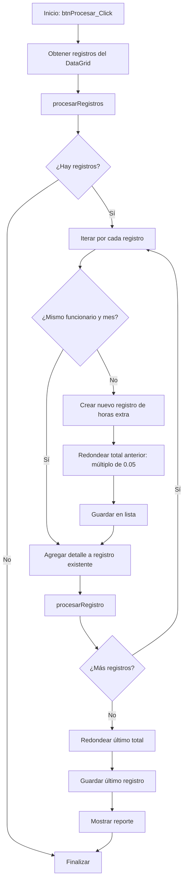

# Análisis del Cálculo de Horas Extra
## Sistema de Horas Extra - UNED

---

## ?? Descripción General

El sistema calcula el pago de horas extra considerando diferentes factores:
- Tipo de jornada del funcionario (Diurna, Nocturna, Mixta)
- Días laborados (normales, primer día libre, segundo día libre, feriados)
- Cantidad de horas trabajadas
- Salario nominal del funcionario

---

## ?? Flujo Principal del Proceso



---

## ?? Proceso de Cálculo por Registro


---

## ?? Cálculo de Horas Mes según Tipo de Jornada


### Fórmula:
```
HorasMes = HorasBase × (NumJornada / DenomJornada)

Donde:
- HorasBase = 240 (Diurna) | 180 (Nocturna) | 210 (Mixta)
- NumJornada = Numerador de la jornada declarada
- DenomJornada = Denominador de la jornada declarada
```

**Ejemplo:** Si un funcionario tiene jornada diurna de 3/4:
```
HorasMes = 240 × (3/4) = 180 horas
```

---

## ?? Determinación del Tipo de Día


---

## ?? Cálculo de Montos según Tipo de Día

### 1?? Días Feriados y Segundo Día Libre


#### Fórmulas:

**Caso A: Horas trabajadas ? 8**
```
TiempoSencillo = HorasTrabajadas
MontoTotal = (SalarioNominal / HorasMes) × TiempoSencillo
```

**Caso B: Horas trabajadas > 8**
```
TiempoSencillo = 8 horas
TiempoDoble = HorasTrabajadas - 8

MontoTiempoSencillo = (SalarioNominal / HorasMes) × 8
MontoTiempoDoble = (SalarioNominal / (HorasMes / 2)) × TiempoDoble

MontoTotal = MontoTiempoSencillo + MontoTiempoDoble
```

---

### 2?? Días Normales y Primer Día Libre


#### Fórmula:

```
TiempoYMedio = HorasTrabajadas
MontoTotal = (SalarioNominal / (HorasMes / 1.5)) × TiempoYMedio
```

**Equivalente simplificado:**
```
MontoTotal = (SalarioNominal × 1.5 / HorasMes) × TiempoYMedio
```

---

## ?? Cálculo de Diferencia de Horas


### Función `diferenciaHoras`:
```vb
Minutos ? Conversión
   15   ?   0.25
   30   ?   0.50
   45   ?   0.75
  Otro  ?   0.00
```

---

## ?? Redondeo Final

El sistema aplica un redondeo especial al monto total de cada funcionario por mes:


### Fórmula:
```vb
MontoFinal = Math.Round(MontoTotal / 0.05, 0) × 0.05
```

**Ejemplos:**
- 1,234.56 ? 1,234.55
- 1,234.58 ? 1,234.60
- 1,234.52 ? 1,234.50

---

## ?? Estructura de Datos


---

## ?? Ejemplo Completo de Cálculo

### Datos del Funcionario:
- **Identificación:** 1-1234-5678
- **Salario Nominal:** ?500,000
- **Tipo Jornada:** Diurna (D)
- **Jornada:** 1/1 (completa)
- **Días declarados:** L, K, M, J, V (lunes a viernes)
- **Días libres:** S, D (sábado y domingo)

### Escenario: Horas trabajadas en la semana

#### Registro 1: Lunes (día normal)
- **Horas trabajadas:** 3 horas
- **Tipo:** Día normal
- **HorasMes:** 240 × (1/1) = 240

**Cálculo:**
```
Tipo: TIEMPO Y MEDIO
Horas TYM = 3
Monto = (500,000 / (240 / 1.5)) × 3
Monto = (500,000 / 160) × 3
Monto = 3,125 × 3
Monto = ?9,375
```

#### Registro 2: Sábado (primer día libre)
- **Horas trabajadas:** 4 horas
- **Tipo:** Primer día libre

**Cálculo:**
```
Tipo: TIEMPO Y MEDIO
Horas TYM = 4
Monto = (500,000 / 160) × 4
Monto = 3,125 × 4
Monto = ?12,500
```

#### Registro 3: Domingo (segundo día libre)
- **Horas trabajadas:** 5 horas
- **Tipo:** Segundo día libre

**Cálculo:**
```
Tipo: TIEMPO SENCILLO (todas las horas ? 8)
Horas TS = 5
Monto = (500,000 / 240) × 5
Monto = 2,083.33 × 5
Monto = ?10,416.65
```

#### Registro 4: 25 de diciembre (feriado)
- **Horas trabajadas:** 10 horas
- **Tipo:** Feriado

**Cálculo:**
```
Tipo: MIXTO (TS + TD)
Horas TS = 8
Horas TD = 2

Monto TS = (500,000 / 240) × 8 = 2,083.33 × 8 = ?16,666.64
Monto TD = (500,000 / 120) × 2 = 4,166.67 × 2 = ?8,333.34

Monto Total = 16,666.64 + 8,333.34 = ?24,999.98
```

### Total del Mes (antes de redondeo):
```
Total = 9,375 + 12,500 + 10,416.65 + 24,999.98
Total = ?57,291.63
```

### Total Final (después de redondeo a 0.05):
```
Redondeo = Round(57,291.63 / 0.05, 0) × 0.05
Redondeo = Round(1,145,832.6, 0) × 0.05
Redondeo = 1,145,833 × 0.05
Total Final = ?57,291.65
```

---

## ?? Resumen de Tasas de Pago

| Tipo de Día | Condición | Tasa de Pago | Fórmula |
|-------------|-----------|--------------|---------|
| **Día Normal** | - | 1.5× | `Salario / (HorasMes / 1.5)` |
| **Primer Día Libre** | - | 1.5× | `Salario / (HorasMes / 1.5)` |
| **Segundo Día Libre** | Horas ? 8 | 1.0× | `Salario / HorasMes` |
| **Segundo Día Libre** | Horas > 8 (primeras 8) | 1.0× | `Salario / HorasMes` |
| **Segundo Día Libre** | Horas > 8 (restantes) | 2.0× | `Salario / (HorasMes / 2)` |
| **Feriado** | Horas ? 8 | 1.0× | `Salario / HorasMes` |
| **Feriado** | Horas > 8 (primeras 8) | 1.0× | `Salario / HorasMes` |
| **Feriado** | Horas > 8 (restantes) | 2.0× | `Salario / (HorasMes / 2)` |

---

## ??? Funciones Auxiliares Clave

### 1. `traerSalarioNominal`
- Obtiene la escala salarial vigente para la fecha
- Convierte la identificación al formato AS400
- Consulta el salario desde el sistema AS400
- Retorna el salario dividido entre 100

### 2. `datosDeclaracion`
- Consulta la declaración de jornada del funcionario
- Retorna tipo de jornada y fracción (numerador/denominador)

### 3. `diasDeclaracion`
- Obtiene los días declarados en la jornada laboral
- Retorna lista de días: L, K, M, J, V, S, D

### 4. `diaFeriado`
- Consulta en BD si la fecha es feriado nacional
- Retorna `True` o `False`

### 5. `convertiCedulaSGDPAS400`
- Convierte formato de cédula de SGD a formato AS400
- Ejemplo: 010800681 ? 1-0800-681

---

## ?? Manejo de Errores

El sistema registra errores por cada registro que no puede procesar:


**Formato del error:**
```
"Consecutivo #[N], Linea #[M], De las Horas Laboradas en [Fecha] 
no Pudo Ser Procesado ([Mensaje de error])"
```

---

## ?? Validaciones

1. **Fecha Final ? Fecha Inicial**
2. **Existencia de registros en el rango de fechas**
3. **Datos de declaración de jornada completos**
4. **Tipo de funcionario válido (Nacional/Extranjero)**
5. **Identificación AS400 disponible**
6. **Escala salarial vigente para la fecha**
7. **Salario nominal > 0**

---

## ?? Notas Importantes

1. **Agrupación:** Los registros se agrupan por funcionario, año y mes
2. **Orden:** Los registros deben estar ordenados por identificación, año, mes
3. **Redondeo:** Se aplica solo al final del mes completo, no por registro
4. **Minutos:** Solo se reconocen intervalos de 15 minutos (0, 15, 30, 45)
5. **Días Libres:** El orden de los días libres es importante para determinar el segundo día libre
6. **Salario:** Se obtiene del sistema AS400 en tiempo real para cada fecha

---

## ?? Optimizaciones Posibles

1. Cachear consultas de salario para la misma fecha
2. Pre-cargar feriados del año en memoria
3. Validar datos antes de procesamiento masivo
4. Implementar procesamiento asíncrono para grandes volúmenes
5. Agregar logs detallados del proceso de cálculo

---

*Documento generado a partir del análisis del código fuente del Sistema de Horas Extra - UNED*
