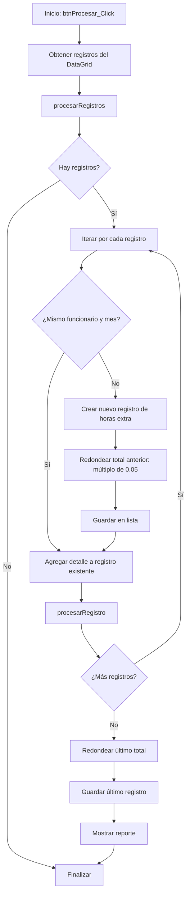
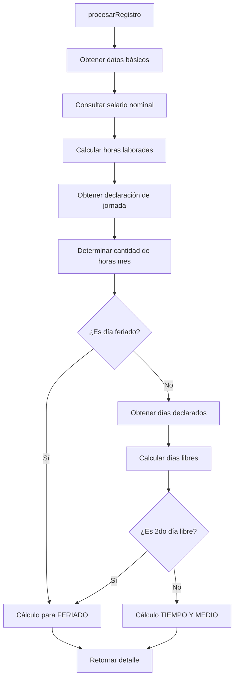
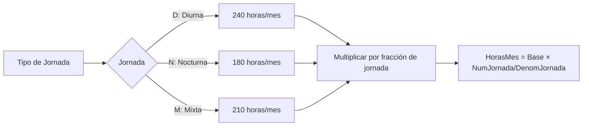
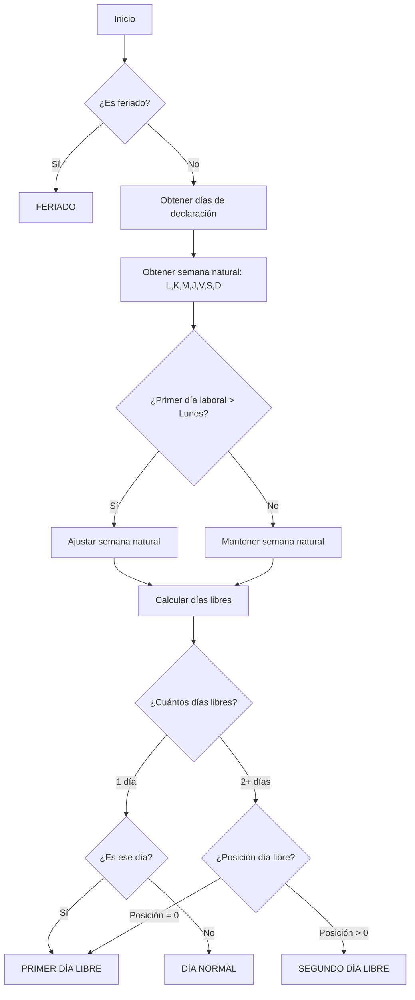
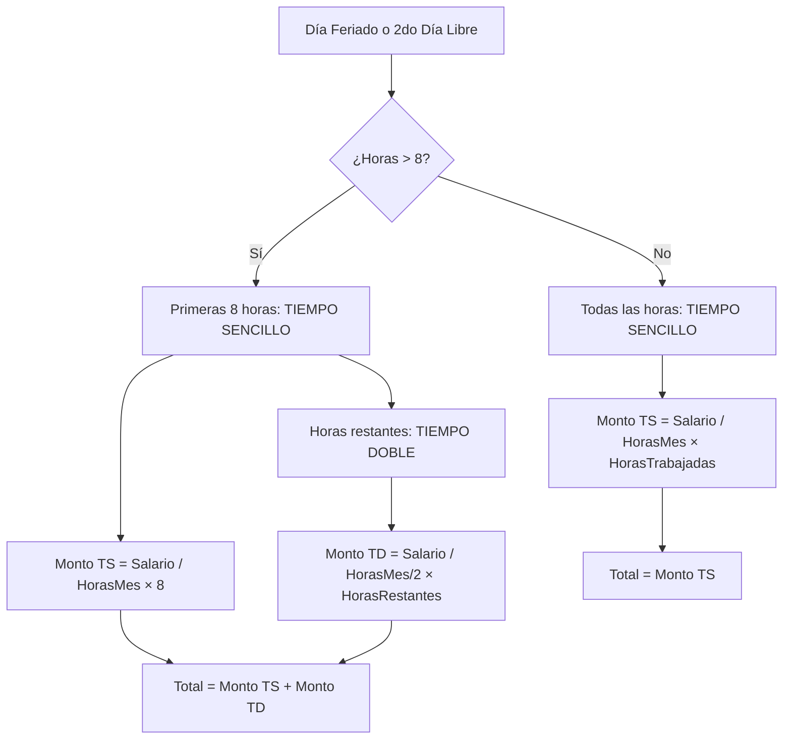
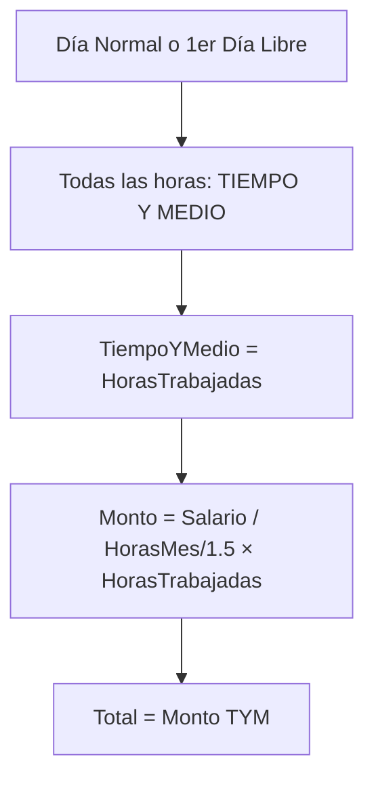
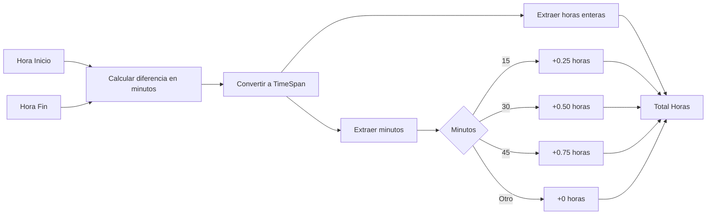
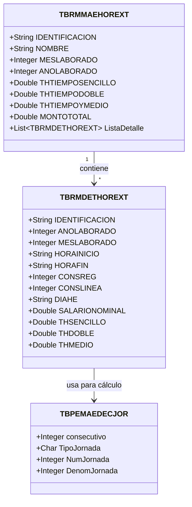

# Análisis del Cálculo de Horas Extra
## Sistema de Horas Extra - UNED

---

## 📋 Descripción General

El sistema calcula el pago de horas extra considerando diferentes factores:
- Tipo de jornada del funcionario (Diurna, Nocturna, Mixta)
- Días laborados (normales, primer día libre, segundo día libre, feriados)
- Cantidad de horas trabajadas
- Salario nominal del funcionario

---

## 🔄 Flujo Principal del Proceso


```mermaid
flowchart TD
    A[Inicio: btnProcesar_Click] --> B[Obtener registros del DataGrid]
    B --> C[procesarRegistros]
    C --> D{Hay registros?}
    D -->|No| E[Finalizar]
    D -->|Sí| F[Iterar por cada registro]
    F --> G{¿Mismo funcionario y mes?}
    G -->|Sí| H[Agregar detalle a registro existente]
    G -->|No| I[Crear nuevo registro de horas extra]
    I --> J[Redondear total anterior: múltiplo de 0.05]
    J --> K[Guardar en lista]
    K --> H
    H --> L[procesarRegistro]
    L --> M{¿Más registros?}
    M -->|Sí| F
    M -->|No| N[Redondear último total]
    N --> O[Guardar último registro]
    O --> P[Mostrar reporte]
    P --> E
```

---

## 📊 Proceso de Cálculo por Registro


```mermaid
flowchart TD
    A[procesarRegistro] --> B[Obtener datos básicos]
    B --> C[Consultar salario nominal]
    C --> D[Calcular horas laboradas]
    D --> E[Obtener declaración de jornada]
    E --> F[Determinar cantidad de horas mes]
    F --> G{¿Es día feriado?}
    G -->|Sí| H[Cálculo para FERIADO]
    G -->|No| I[Obtener días declarados]
    I --> J[Calcular días libres]
    J --> K{¿Es 2do día libre?}
    K -->|Sí| H
    K -->|No| L[Cálculo TIEMPO Y MEDIO]
    H --> M[Retornar detalle]
    L --> M
```

---

## 📈 Cálculo de Horas Mes según Tipo de Jornada


```mermaid
graph LR
    A[Tipo de Jornada] --> B{Jornada}
    B -->|D: Diurna| C[240 horas/mes]
    B -->|N: Nocturna| D[180 horas/mes]
    B -->|M: Mixta| E[210 horas/mes]
    C --> F[Multiplicar por fracción de jornada]
    D --> F
    E --> F
    F --> G[HorasMes = Base × NumJornada/DenomJornada]
```

### Fórmula:
```
HorasMes = HorasBase × (NumJornada / DenomJornada)

Donde:
- HorasBase = 240 (Diurna) | 180 (Nocturna) | 210 (Mixta)
- NumJornada = Numerador de la jornada declarada
- DenomJornada = Denominador de la jornada declarada
```

**Ejemplo:** Si un funcionario tiene jornada diurna de 3/4:
```
HorasMes = 240 × (3/4) = 180 horas
```

---

## 🗓️ Determinación del Tipo de Día


```mermaid
flowchart TD
    A[Inicio] --> B{¿Es feriado?}
    B -->|Sí| C[FERIADO]
    B -->|No| D[Obtener días de declaración]
    D --> E[Obtener semana natural: L,K,M,J,V,S,D]
    E --> F{¿Primer día laboral > Lunes?}
    F -->|Sí| G[Ajustar semana natural]
    F -->|No| H[Mantener semana natural]
    G --> I[Calcular días libres]
    H --> I
    I --> J{¿Cuántos días libres?}
    J -->|1 día| K{¿Es ese día?}
    J -->|2+ días| L{¿Posición día libre?}
    K -->|Sí| M[PRIMER DÍA LIBRE]
    K -->|No| N[DÍA NORMAL]
    L -->|Posición > 0| O[SEGUNDO DÍA LIBRE]
    L -->|Posición = 0| M
```

---

## 💰 Cálculo de Montos según Tipo de Día

### 1️⃣ Días Feriados y Segundo Día Libre


```mermaid
flowchart TD
    A[Día Feriado o 2do Día Libre] --> B{¿Horas > 8?}
    B -->|Sí| C[Primeras 8 horas: TIEMPO SENCILLO]
    B -->|No| D[Todas las horas: TIEMPO SENCILLO]
    C --> E[Horas restantes: TIEMPO DOBLE]
    C --> F[Monto TS = Salario / HorasMes × 8]
    E --> G[Monto TD = Salario / HorasMes/2 × HorasRestantes]
    D --> H[Monto TS = Salario / HorasMes × HorasTrabajadas]
    F --> I[Total = Monto TS + Monto TD]
    G --> I
    H --> J[Total = Monto TS]
```

#### Fórmulas:

**Caso A: Horas trabajadas ≤ 8**
```
TiempoSencillo = HorasTrabajadas
MontoTotal = (SalarioNominal / HorasMes) × TiempoSencillo
```

**Caso B: Horas trabajadas > 8**
```
TiempoSencillo = 8 horas
TiempoDoble = HorasTrabajadas - 8

MontoTiempoSencillo = (SalarioNominal / HorasMes) × 8
MontoTiempoDoble = (SalarioNominal / (HorasMes / 2)) × TiempoDoble

MontoTotal = MontoTiempoSencillo + MontoTiempoDoble
```

---

### 2️⃣ Días Normales y Primer Día Libre


```mermaid
flowchart TD
    A[Día Normal o 1er Día Libre] --> B[Todas las horas: TIEMPO Y MEDIO]
    B --> C[TiempoYMedio = HorasTrabajadas]
    C --> D[Monto = Salario / HorasMes/1.5 × HorasTrabajadas]
    D --> E[Total = Monto TYM]
```

#### Fórmula:

```
TiempoYMedio = HorasTrabajadas
MontoTotal = (SalarioNominal / (HorasMes / 1.5)) × TiempoYMedio
```

**Equivalente simplificado:**
```
MontoTotal = (SalarioNominal × 1.5 / HorasMes) × TiempoYMedio
```

---

## ⏱️ Cálculo de Diferencia de Horas


```mermaid
flowchart LR
    A[Hora Inicio] --> B[Calcular diferencia en minutos]
    C[Hora Fin] --> B
    B --> D[Convertir a TimeSpan]
    D --> E[Extraer horas enteras]
    D --> F[Extraer minutos]
    F --> G{Minutos}
    G -->|15| H[+0.25 horas]
    G -->|30| I[+0.50 horas]
    G -->|45| J[+0.75 horas]
    G -->|Otro| K[+0 horas]
    E --> L[Total Horas]
    H --> L
    I --> L
    J --> L
    K --> L
```

### Función `diferenciaHoras`:
```vb
Minutos → Conversión
   15   →   0.25
   30   →   0.50
   45   →   0.75
  Otro  →   0.00
```

---

## 🔢 Redondeo Final

El sistema aplica un redondeo especial al monto total de cada funcionario por mes:


```mermaid
flowchart LR
    A[Monto Total Calculado] --> B[Dividir entre 0.05]
    B --> C[Redondear al entero más cercano]
    C --> D[Multiplicar por 0.05]
    D --> E[Monto Total Final]
```

### Fórmula:
```vb
MontoFinal = Math.Round(MontoTotal / 0.05, 0) × 0.05
```

**Ejemplos:**
- 1,234.56 → 1,234.55
- 1,234.58 → 1,234.60
- 1,234.52 → 1,234.50

---

## 🗂️ Estructura de Datos


```mermaid
classDiagram
    class TBRMMAEHOREXT {
        +String IDENTIFICACION
        +String NOMBRE
        +Integer MESLABORADO
        +Integer ANOLABORADO
        +Double THTIEMPOSENCILLO
        +Double THTIEMPODOBLE
        +Double THTIEMPOYMEDIO
        +Double MONTOTOTAL
        +List~TBRMDETHOREXT~ ListaDetalle
    }
    
    class TBRMDETHOREXT {
        +String IDENTIFICACION
        +Integer ANOLABORADO
        +Integer MESLABORADO
        +String HORAINICIO
        +String HORAFIN
        +Integer CONSREG
        +Integer CONSLINEA
        +String DIAHE
        +Double SALARIONOMINAL
        +Double THSENCILLO
        +Double THDOBLE
        +Double THMEDIO
    }
    
    class TBPEMAEDECJOR {
        +Integer consecutivo
        +Char TipoJornada
        +Integer NumJornada
        +Integer DenomJornada
    }
    
    TBRMMAEHOREXT "1" --> "*" TBRMDETHOREXT : contiene
    TBRMDETHOREXT --> TBPEMAEDECJOR : usa para cálculo
```

---

## 📝 Ejemplo Completo de Cálculo

### Datos del Funcionario:
- **Identificación:** 1-1234-5678
- **Salario Nominal:** ₡500,000
- **Tipo Jornada:** Diurna (D)
- **Jornada:** 1/1 (completa)
- **Días declarados:** L, K, M, J, V (lunes a viernes)
- **Días libres:** S, D (sábado y domingo)

### Escenario: Horas trabajadas en la semana

#### Registro 1: Lunes (día normal)
- **Horas trabajadas:** 3 horas
- **Tipo:** Día normal
- **HorasMes:** 240 × (1/1) = 240

**Cálculo:**
```
Tipo: TIEMPO Y MEDIO
Horas TYM = 3
Monto = (500,000 / (240 / 1.5)) × 3
Monto = (500,000 / 160) × 3
Monto = 3,125 × 3
Monto = ₡9,375
```

#### Registro 2: Sábado (primer día libre)
- **Horas trabajadas:** 4 horas
- **Tipo:** Primer día libre

**Cálculo:**
```
Tipo: TIEMPO Y MEDIO
Horas TYM = 4
Monto = (500,000 / 160) × 4
Monto = 3,125 × 4
Monto = ₡12,500
```

#### Registro 3: Domingo (segundo día libre)
- **Horas trabajadas:** 5 horas
- **Tipo:** Segundo día libre

**Cálculo:**
```
Tipo: TIEMPO SENCILLO (todas las horas ≤ 8)
Horas TS = 5
Monto = (500,000 / 240) × 5
Monto = 2,083.33 × 5
Monto = ₡10,416.65
```

#### Registro 4: 25 de diciembre (feriado)
- **Horas trabajadas:** 10 horas
- **Tipo:** Feriado

**Cálculo:**
```
Tipo: MIXTO (TS + TD)
Horas TS = 8
Horas TD = 2

Monto TS = (500,000 / 240) × 8 = 2,083.33 × 8 = ₡16,666.64
Monto TD = (500,000 / 120) × 2 = 4,166.67 × 2 = ₡8,333.34

Monto Total = 16,666.64 + 8,333.34 = ₡24,999.98
```

### Total del Mes (antes de redondeo):
```
Total = 9,375 + 12,500 + 10,416.65 + 24,999.98
Total = ₡57,291.63
```

### Total Final (después de redondeo a 0.05):
```
Redondeo = Round(57,291.63 / 0.05, 0) × 0.05
Redondeo = Round(1,145,832.6, 0) × 0.05
Redondeo = 1,145,833 × 0.05
Total Final = ₡57,291.65
```

---

## 📊 Resumen de Tasas de Pago

| Tipo de Día | Condición | Tasa de Pago | Fórmula |
|-------------|-----------|--------------|---------|
| **Día Normal** | - | 1.5× | `Salario / (HorasMes / 1.5)` |
| **Primer Día Libre** | - | 1.5× | `Salario / (HorasMes / 1.5)` |
| **Segundo Día Libre** | Horas ≤ 8 | 1.0× | `Salario / HorasMes` |
| **Segundo Día Libre** | Horas > 8 (primeras 8) | 1.0× | `Salario / HorasMes` |
| **Segundo Día Libre** | Horas > 8 (restantes) | 2.0× | `Salario / (HorasMes / 2)` |
| **Feriado** | Horas ≤ 8 | 1.0× | `Salario / HorasMes` |
| **Feriado** | Horas > 8 (primeras 8) | 1.0× | `Salario / HorasMes` |
| **Feriado** | Horas > 8 (restantes) | 2.0× | `Salario / (HorasMes / 2)` |

---

## 🔧 Funciones Auxiliares Clave

### 1. `traerSalarioNominal`
- Obtiene la escala salarial vigente para la fecha
- Convierte la identificación al formato AS400
- Consulta el salario desde el sistema AS400
- Retorna el salario dividido entre 100

### 2. `datosDeclaracion`
- Consulta la declaración de jornada del funcionario
- Retorna tipo de jornada y fracción (numerador/denominador)

### 3. `diasDeclaracion`
- Obtiene los días declarados en la jornada laboral
- Retorna lista de días: L, K, M, J, V, S, D

### 4. `diaFeriado`
- Consulta en BD si la fecha es feriado nacional
- Retorna `True` o `False`

### 5. `convertiCedulaSGDPAS400`
- Convierte formato de cédula de SGD a formato AS400
- Ejemplo: 010800681 → 1-0800-681

---

## ⚠️ Manejo de Errores

El sistema registra errores por cada registro que no puede procesar:


```mermaid
flowchart LR
    A[Error en procesarRegistro] --> B[Capturar excepción]
    B --> C[Crear mensaje de error]
    C --> D[Incluir: Consecutivo, Línea, Fecha]
    D --> E[Agregar a cListaErrores]
    E --> F[Continuar con siguiente registro]
    F --> G[Mostrar errores en reporte final]
```

**Formato del error:**
```
"Consecutivo #[N], Linea #[M], De las Horas Laboradas en [Fecha] 
no Pudo Ser Procesado ([Mensaje de error])"
```

---

## ✅ Validaciones

1. **Fecha Final ≥ Fecha Inicial**
2. **Existencia de registros en el rango de fechas**
3. **Datos de declaración de jornada completos**
4. **Tipo de funcionario válido (Nacional/Extranjero)**
5. **Identificación AS400 disponible**
6. **Escala salarial vigente para la fecha**
7. **Salario nominal > 0**

---

## 📌 Notas Importantes

1. **Agrupación:** Los registros se agrupan por funcionario, año y mes
2. **Orden:** Los registros deben estar ordenados por identificación, año, mes
3. **Redondeo:** Se aplica solo al final del mes completo, no por registro
4. **Minutos:** Solo se reconocen intervalos de 15 minutos (0, 15, 30, 45)
5. **Días Libres:** El orden de los días libres es importante para determinar el segundo día libre
6. **Salario:** Se obtiene del sistema AS400 en tiempo real para cada fecha

---

## 🚀 Optimizaciones Posibles

1. Cachear consultas de salario para la misma fecha
2. Pre-cargar feriados del año en memoria
3. Validar datos antes de procesamiento masivo
4. Implementar procesamiento asíncrono para grandes volúmenes
5. Agregar logs detallados del proceso de cálculo

---

*Documento generado a partir del análisis del código fuente del Sistema de Horas Extra - UNED*
