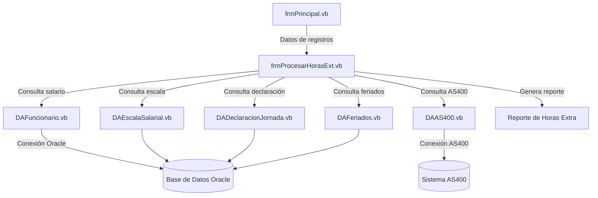
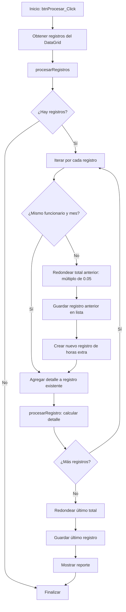
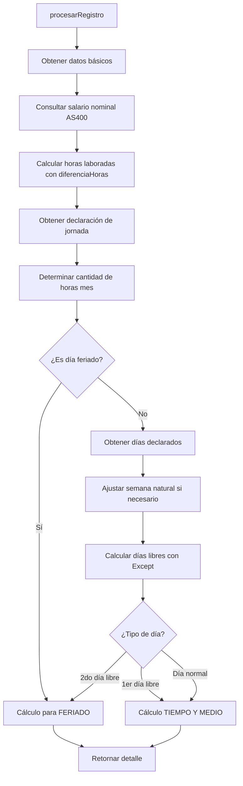
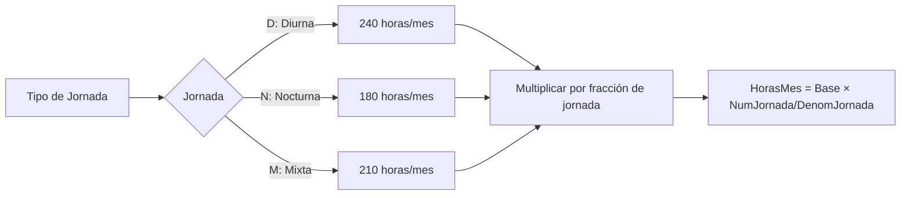
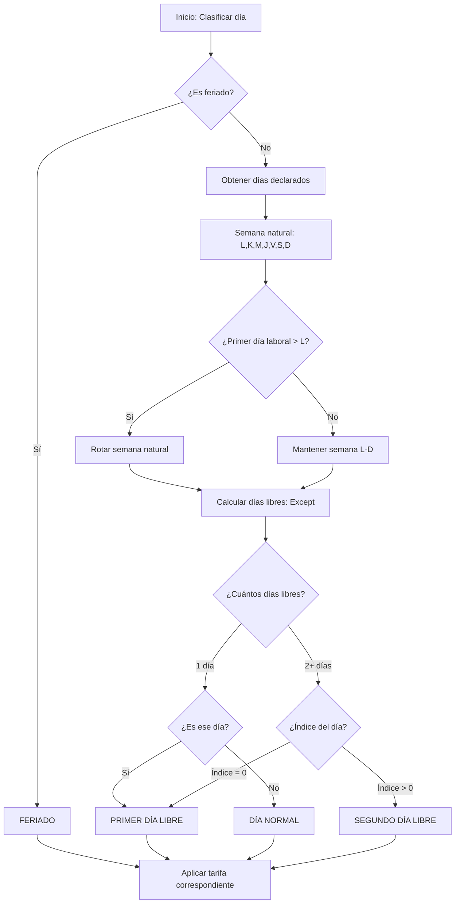
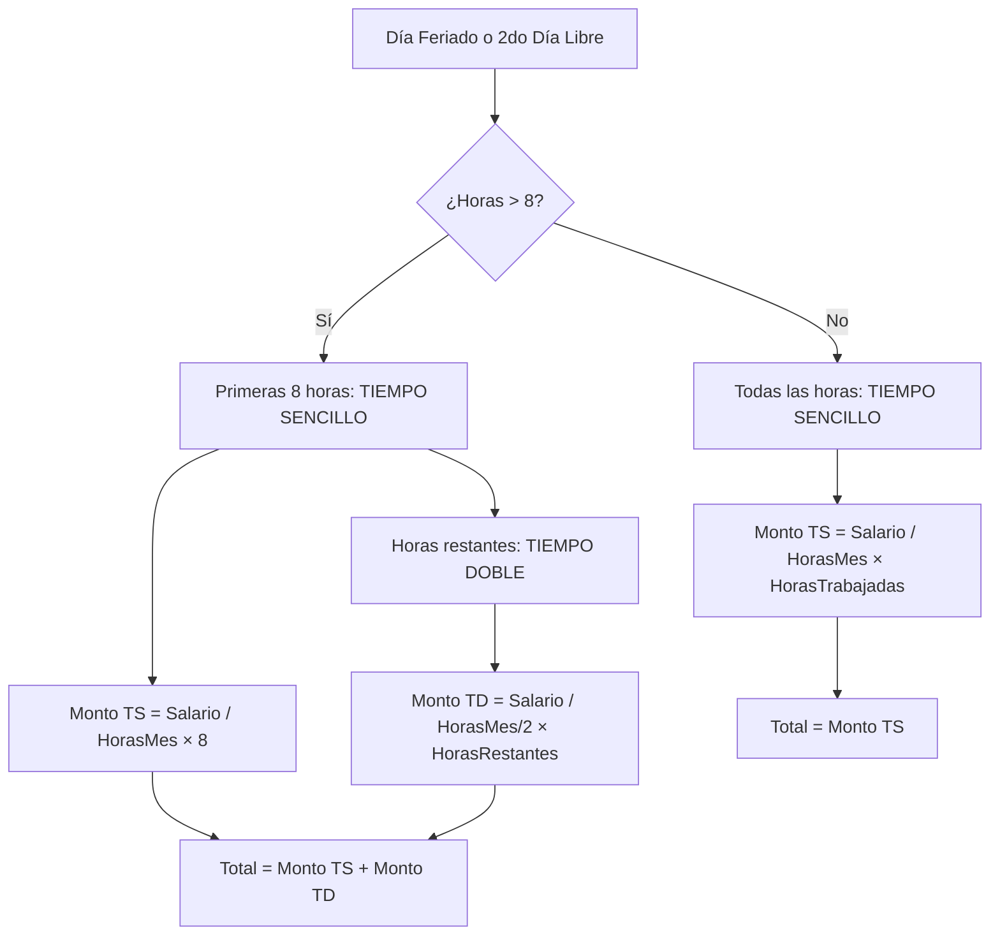
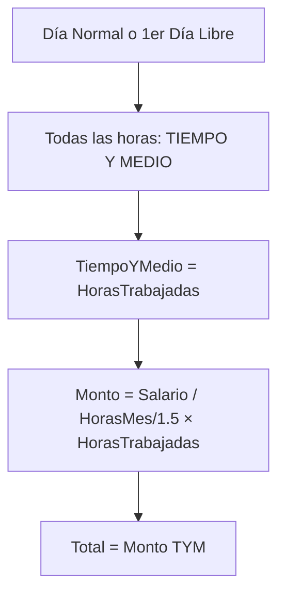
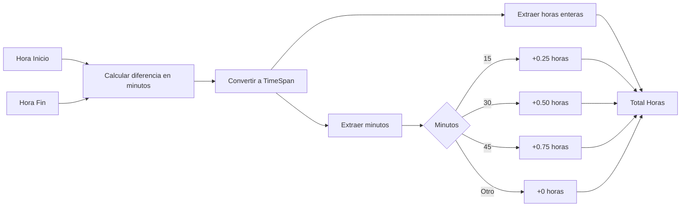
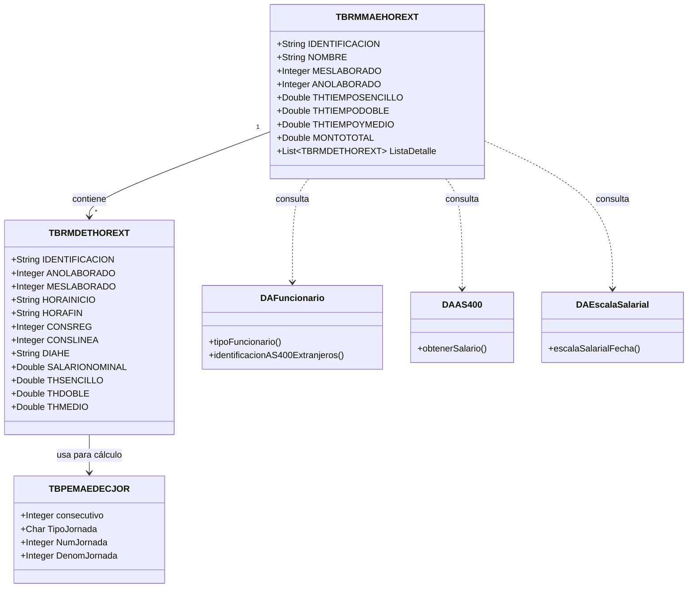
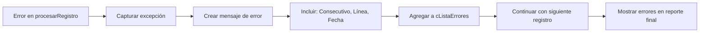

# Análisis del Cálculo de Horas Extra
## Sistema de Horas Extra - UNED

**Versión:** 2.0  
**Última actualización:** Febrero 2026  
**Archivo principal:** `frmProcesarHorasExt.vb`  
**Ubicación:** `Escritorio/DesktopAppHorasExtras/FORMS/CONSULTA/`

---

## 📋 Descripción General

El sistema calcula el pago de horas extra considerando diferentes factores:
- **Tipo de jornada** del funcionario (Diurna, Nocturna, Mixta)
- **Días laborados** (normales, primer día libre, segundo día libre, feriados)
- **Cantidad de horas trabajadas** (en intervalos de 15 minutos)
- **Salario nominal** del funcionario (obtenido del sistema AS400)
- **Fracción de jornada** (tiempo completo, medio tiempo, tres cuartos, etc.)

### 🎯 Objetivo del Sistema
Automatizar el cálculo de pagos por horas extraordinarias laboradas por funcionarios de la UNED, asegurando el cumplimiento de las normativas laborales costarricenses y aplicando correctamente las tasas diferenciadas según el tipo de día.

### 🏗️ Arquitectura del Sistema



**Capas del sistema:**
- **Presentación:** Forms (frmProcesarHorasExt.vb, frmHorasExtra.vb)
- **Lógica de Negocio:** Funciones de cálculo en el formulario
- **Acceso a Datos:** DataAccess layer (DA*.vb)
- **Entidades:** HE_Entity (TB*.vb)
- **Integración:** Conexión con AS400 para salarios

---

## 🔄 Flujo Principal del Proceso



### 📌 Notas sobre el Flujo:
1. Los registros deben estar **ordenados por identificación, año y mes**
2. El redondeo se aplica **al finalizar cada mes por funcionario**
3. Los errores se capturan individualmente sin detener el proceso
4. Se acumulan tres tipos de tiempo: Sencillo, Doble y Tiempo y Medio

---

## 🔍 Proceso de Cálculo por Registro



---

## 📊 Cálculo de Horas Mes según Tipo de Jornada



### Fórmula:
```
HorasMes = HorasBase × (NumJornada / DenomJornada)

Donde:
- HorasBase = 240 (Diurna) | 180 (Nocturna) | 210 (Mixta)
- NumJornada = Numerador de la jornada declarada (ej: 3 para 3/4)
- DenomJornada = Denominador de la jornada declarada (ej: 4 para 3/4)
```

### Código VB:
```vb
' Datos estáticos definidos en el código
Select Case lTipoJornada
    Case "D"
        lCantidadHorasMes = 240
    Case "N"
        lCantidadHorasMes = 180
    Case "M"
        lCantidadHorasMes = 210
End Select

lCantidadHorasMes = (lCantidadHorasMes * (lDeclarJornada.NumJornada / lDeclarJornada.DenomJornada))
```

**Ejemplos comunes:**

| Tipo Jornada | Fracción | Cálculo | Horas/Mes |
|--------------|----------|---------|-----------|
| Diurna | 1/1 (Completa) | 240 × (1/1) | 240 |
| Diurna | 3/4 (Tres cuartos) | 240 × (3/4) | 180 |
| Diurna | 1/2 (Medio tiempo) | 240 × (1/2) | 120 |
| Nocturna | 1/1 (Completa) | 180 × (1/1) | 180 |
| Mixta | 1/1 (Completa) | 210 × (1/1) | 210 |

> ⚠️ **Nota:** Estas horas base son valores estáticos definidos en el código y representan las horas mensuales estándar para cada tipo de jornada.

---

## 📅 Determinación del Tipo de Día



### 🔍 Detalles de la Lógica de Días Libres

**Ajuste de Semana Natural:**  
Si la jornada laboral inicia en un día diferente al lunes, la semana natural se ajusta rotando los días. Por ejemplo:
- Si la semana laboral inicia en **Martes (K)**: La semana natural se rota 2 posiciones → `[M,J,V,S,D,L,K]`
- Esto asegura que los días libres se identifiquen en el orden correcto

**Código VB:**
```vb
Dim lDiasSemana As New List(Of String) From {"L", "K", "M", "J", "V", "S", "D"}
Dim lPrimerDiaSemana As Integer = numeroDia(lDiasDeclara(0))

If lPrimerDiaSemana > 1 Then
    For i As Integer = 1 To lPrimerDiaSemana
        lDiasSemana.Add(lDiasSemana(0))  ' Mover primer día al final
        lDiasSemana.RemoveAt(0)
    Next
End If
```

**Cálculo de Días Libres:**
```vb
' Se usa la operación Except para obtener los días no declarados
lDiasLibres = lDiasSemana.Except(lDiasDeclara).ToList
```

**Determinación de Primer vs Segundo Día Libre:**
```vb
If ((lDiasLibres.Count = 1) Or (lDiasLibres.IndexOf(pDiaSemana) > 0)) Then
    ' Es el segundo día libre
Else
    ' Es día normal o primer día libre
End If
```

- **Primer día libre:** Es el día libre que aparece primero en la lista ajustada (índice = 0)
- **Segundo día libre:** Cualquier otro día libre (índice > 0)
- **Caso especial:** Si solo hay 1 día libre, ese es el primer día libre

---

## 💰 Cálculo de Montos según Tipo de Día

### 1️⃣ Días Feriados y Segundo Día Libre



#### Fórmulas:

**Caso A: Horas trabajadas ≤ 8**
```
TiempoSencillo = HorasTrabajadas
MontoTotal = (SalarioNominal / HorasMes) × TiempoSencillo
```

**Caso B: Horas trabajadas > 8**
```
TiempoSencillo = 8 horas
TiempoDoble = HorasTrabajadas - 8

MontoTiempoSencillo = (SalarioNominal / HorasMes) × 8
MontoTiempoDoble = (SalarioNominal / (HorasMes / 2)) × TiempoDoble

MontoTotal = MontoTiempoSencillo + MontoTiempoDoble
```

**Código VB:**
```vb
If (lCantidadHorasLaboradas > 8) Then
    .THSENCILLO = 8
    pMaeHorasExtra.THTIEMPOSENCILLO += 8
    
    .THDOBLE = (lCantidadHorasLaboradas - 8)
    pMaeHorasExtra.THTIEMPODOBLE += (lCantidadHorasLaboradas - 8)
    
    ' Calcular monto a TIEMPO DOBLE
    pMaeHorasExtra.MONTOTOTAL += ((lDetalleHorasExtra.SALARIONOMINAL / (lCantidadHorasMes / 2)) * .THDOBLE)
Else
    .THSENCILLO = lCantidadHorasLaboradas
    pMaeHorasExtra.THTIEMPOSENCILLO += lCantidadHorasLaboradas
End If

' Calcular monto a TIEMPO SENCILLO
pMaeHorasExtra.MONTOTOTAL += ((lDetalleHorasExtra.SALARIONOMINAL / (lCantidadHorasMes / 1)) * .THSENCILLO)
```

---

### 2️⃣ Días Normales y Primer Día Libre



#### Fórmula:

```
TiempoYMedio = HorasTrabajadas
MontoTotal = (SalarioNominal / (HorasMes / 1.5)) × TiempoYMedio
```

**Equivalente simplificado:**
```
MontoTotal = (SalarioNominal × 1.5 / HorasMes) × TiempoYMedio
```

**Código VB:**
```vb
.THMEDIO = lCantidadHorasLaboradas
pMaeHorasExtra.THTIEMPOYMEDIO += lCantidadHorasLaboradas

' Calcular monto a TIEMPO Y MEDIO
pMaeHorasExtra.MONTOTOTAL += ((lDetalleHorasExtra.SALARIONOMINAL / (lCantidadHorasMes / 1.5)) * .THMEDIO)
```

---

## ⏱️ Cálculo de Diferencia de Horas



### Función `diferenciaHoras`:

**Tabla de conversión:**
```
Minutos → Conversión
   15   →   0.25
   30   →   0.50
   45   →   0.75
  Otro  →   0.00
```

**Código VB:**
```vb
Private Function diferenciaHoras(pHoraIni As DateTime, pHoraFin As DateTime) As Double
    Dim lDiferenciaMinutos As Long = DateDiff(DateInterval.Minute, pHoraIni, pHoraFin)
    Dim lIntervalo As TimeSpan = New TimeSpan(0, lDiferenciaMinutos, 0)
    
    Dim lHoras As Double = lIntervalo.Hours
    Dim lMinutos As Integer = lIntervalo.Minutes
    
    Select Case lMinutos
        Case 15
            lHoras += 0.25
        Case 30
            lHoras += 0.5
        Case 45
            lHoras += 0.75
    End Select
    
    Return lHoras
End Function
```

**Ejemplos:**
```
08:00 → 11:15 = 195 min = 3h 15m = 3.25 horas
08:00 → 11:30 = 210 min = 3h 30m = 3.50 horas
08:00 → 11:45 = 225 min = 3h 45m = 3.75 horas
08:00 → 11:20 = 200 min = 3h 20m = 3.00 horas  (se ignoran los 20 min)
```

> ⚠️ **Importante:** Solo los minutos 15, 30 y 45 se reconocen como fracciones. Cualquier otro valor de minutos se ignora.

---

## 🔄 Redondeo Final

El sistema aplica un redondeo especial al monto total de cada funcionario por mes:


### Fórmula:
```vb
MontoFinal = Math.Round(MontoTotal / 0.05, 0) × 0.05
```

### Código VB:
```vb
' Tras terminar el cálculo por mes de un funcionario, redondeamos el total a múltiplo de 0.05
lHorasExtra.MONTOTOTAL = Math.Round(lHorasExtra.MONTOTOTAL / 0.05, 0) * 0.05
```

**Ejemplos:**
```
1,234.56 → 1,234.55  (redondeado hacia abajo)
1,234.58 → 1,234.60  (redondeado hacia arriba)
1,234.52 → 1,234.50  (redondeado hacia abajo)
1,234.575 → 1,234.60 (exactamente en el medio, redondea hacia arriba)
```

---

## 📦 Estructura de Datos



---

## 📝 Ejemplo Completo de Cálculo

### Datos del Funcionario:
- **Identificación:** 1-1234-5678
- **Nombre:** Juan Pérez Gómez
- **Salario Nominal:** ₡500,000
- **Tipo Jornada:** Diurna (D)
- **Jornada:** 1/1 (completa)
- **Días declarados:** L, K, M, J, V (lunes a viernes)
- **Días libres:** S, D (sábado y domingo)
- **Mes laborado:** Diciembre 2025

### Escenario: Horas trabajadas en la semana

#### Registro 1: Lunes 8 de diciembre (día normal)
- **Horas trabajadas:** 3 horas (08:00 - 11:00)
- **Tipo:** Día normal
- **HorasMes:** 240 × (1/1) = 240

**Cálculo:**
```
Tipo: TIEMPO Y MEDIO
Horas TYM = 3
Monto = (500,000 / (240 / 1.5)) × 3
Monto = (500,000 / 160) × 3
Monto = 3,125 × 3
Monto = ₡9,375.00
```

#### Registro 2: Sábado 13 de diciembre (primer día libre)
- **Horas trabajadas:** 4 horas (14:00 - 18:00)
- **Tipo:** Primer día libre (índice = 0 en días libres)

**Cálculo:**
```
Tipo: TIEMPO Y MEDIO
Horas TYM = 4
Monto = (500,000 / 160) × 4
Monto = 3,125 × 4
Monto = ₡12,500.00
```

#### Registro 3: Domingo 14 de diciembre (segundo día libre)
- **Horas trabajadas:** 5 horas (09:00 - 14:00)
- **Tipo:** Segundo día libre (índice = 1 en días libres)

**Cálculo:**
```
Tipo: TIEMPO SENCILLO (todas las horas ≤ 8)
Horas TS = 5
Monto = (500,000 / 240) × 5
Monto = 2,083.33 × 5
Monto = ₡10,416.65
```

#### Registro 4: Jueves 25 de diciembre (feriado - Navidad)
- **Horas trabajadas:** 10 horas (08:00 - 18:00)
- **Tipo:** Feriado nacional

**Cálculo:**
```
Tipo: MIXTO (TS + TD)
Horas TS = 8 (primeras 8 horas)
Horas TD = 2 (horas restantes)

Monto TS = (500,000 / 240) × 8 = 2,083.33 × 8 = ₡16,666.64
Monto TD = (500,000 / 120) × 2 = 4,166.67 × 2 = ₡8,333.34

Monto Total = 16,666.64 + 8,333.34 = ₡24,999.98
```

#### Registro 5: Viernes 26 de diciembre (día normal)
- **Horas trabajadas:** 2.5 horas (16:00 - 18:30)
- **Tipo:** Día normal

**Cálculo:**
```
Tipo: TIEMPO Y MEDIO
Horas TYM = 2.5
Monto = (500,000 / 160) × 2.5
Monto = 3,125 × 2.5
Monto = ₡7,812.50
```

### Total del Mes (antes de redondeo):
```
Total = 9,375.00 + 12,500.00 + 10,416.65 + 24,999.98 + 7,812.50
Total = ₡65,104.13
```

### Total Final (después de redondeo a 0.05):
```
Redondeo = Round(65,104.13 / 0.05, 0) × 0.05
Redondeo = Round(1,302,082.6, 0) × 0.05
Redondeo = 1,302,083 × 0.05
Total Final = ₡65,104.15
```

### Resumen del Registro Maestro:
```
IDENTIFICACION:      1-1234-5678
NOMBRE:              Juan Pérez Gómez
MESLABORADO:         12
ANOLABORADO:         2025
THTIEMPOSENCILLO:    13.00 horas
THTIEMPODOBLE:       2.00 horas
THTIEMPOYMEDIO:      9.50 horas
MONTOTOTAL:          ₡65,104.15
```

---

## 📊 Resumen de Tasas de Pago

| Tipo de Día | Condición | Tasa de Pago | Fórmula | Multiplicador |
|-------------|-----------|--------------|---------|---------------|
| **Día Normal** | - | 1.5× | `Salario / (HorasMes / 1.5)` | 150% |
| **Primer Día Libre** | - | 1.5× | `Salario / (HorasMes / 1.5)` | 150% |
| **Segundo Día Libre** | Horas ≤ 8 | 1.0× | `Salario / HorasMes` | 100% |
| **Segundo Día Libre** | Horas > 8 (primeras 8) | 1.0× | `Salario / HorasMes` | 100% |
| **Segundo Día Libre** | Horas > 8 (restantes) | 2.0× | `Salario / (HorasMes / 2)` | 200% |
| **Feriado** | Horas ≤ 8 | 1.0× | `Salario / HorasMes` | 100% |
| **Feriado** | Horas > 8 (primeras 8) | 1.0× | `Salario / HorasMes` | 100% |
| **Feriado** | Horas > 8 (restantes) | 2.0× | `Salario / (HorasMes / 2)` | 200% |

### 🎯 Regla Mnemotécnica:
- **Día normal o 1er libre:** Siempre 1.5×
- **2do libre o feriado:** 1.0× hasta 8 horas, luego 2.0×

---

## 🔧 Funciones Auxiliares Clave

### 1. `traerSalarioNominal`
**Propósito:** Obtener el salario nominal del funcionario para una fecha específica

**Proceso:**
1. Consulta la escala salarial vigente para la fecha (`escalaSalarialFecha`)
2. Determina el tipo de funcionario (Nacional=1, Extranjero=2/3)
3. Convierte la identificación al formato AS400:
   - **Nacionales:** Usa `convertiCedulaSGDPAS400`
   - **Extranjeros:** Usa `identificacionAS400Extranjeros`
4. Consulta el salario desde el sistema AS400
5. Divide el resultado entre 100 (formato AS400 maneja centavos)

**Parámetros:**
- `pIdentificacion` (String): Cédula del funcionario en formato SGD
- `pFechaLaborada` (DateTime): Fecha de las horas trabajadas

**Retorna:** Double (Salario nominal en colones)

**Excepciones:**
- "Tipo de Funcionario no Establecido"
- "No se ha Podido Establecer la Identificación del Funcionario con el Formato AS400"
- "No Se Puede Determinar la Escala Salarial del Funcionario"

**Código VB:**
```vb
Private Function traerSalarioNominal(pIdentidficacion As String, pFechaLaborada As DateTime) As Double
    Dim daEscala As New DAEscalaSalarial
    Dim lEscalaSal As Integer = 0
    Dim lVersionEscala As Integer = 0
    
    daEscala.escalaSalarialFecha(pFechaLaborada, lEscalaSal, lVersionEscala)
    
    If (lEscalaSal > 0) Then
        Dim daFuncionario As New DAFuncionario
        Dim lTipoFunci As Integer = daFuncionario.tipoFuncionario(pIdentidficacion)
        
        If (lTipoFunci = 1) Then ' TIPO 1 = NACIONALES
            lIdentificacionAS400 = convertiCedulaSGDPAS400(pIdentidficacion)
        Else ' TIPO 2/3 = EXTRANJEROS
            lIdentificacionAS400 = daFuncionario.identificacionAS400Extranjeros(pIdentidficacion)
        End If
        
        Dim daAS400 As New DAAS400(New ArrayList())
        lSalario = daAS400.obtenerSalario(lIdentificacionAS400, pFechaLaborada.Year, 
                                          pFechaLaborada.Month, pFechaLaborada.Day, 
                                          lEscalaSal, lVersionEscala) / 100
    End If
    
    Return lSalario
End Function
```

---

### 2. `datosDeclaracion`
**Propósito:** Obtener información de la declaración de jornada del funcionario

**Retorna:** Objeto `TBPEMAEDECJOR` con:
- `consecutivo` (Integer): ID de la declaración
- `TipoJornada` (Char): D, N, o M
- `NumJornada` (Integer): Numerador de la fracción
- `DenomJornada` (Integer): Denominador de la fracción

**Proceso:**
```vb
Call → DADeclaracionJornada.datosDeclaracionJornada(identificacion, fecha)
```

**Excepción:** "No Se Tienen Datos de Declaración de Jornada"

---

### 3. `diasDeclaracion`
**Propósito:** Obtener los días laborales declarados en la jornada

**Parámetro:**
- `pConsecutivo` (Integer): ID de la declaración de jornada

**Retorna:** `List(Of String)` con días: L, K, M, J, V, S, D

**Proceso:**
```vb
Call → DADeclaracionJornada.diasDeclaracionJornada(consecutivo)
Itera sobre el DataTable y extrae cada día
```

**Excepción:** "No se Tienen Datos de los Días de la Declaración de Jornada"

**Código VB:**
```vb
Private Function diasDeclaracion(pConsecutivo As Integer) As List(Of String)
    Dim daDeclaracionJornada As New DADeclaracionJornada
    Dim lDatos As DataTable = daDeclaracionJornada.diasDeclaracionJornada(pConsecutivo)
    Dim lDiasDeclara As New List(Of String)
    
    If (Not IsNothing(lDatos)) Then
        If (lDatos.Rows.Count > 0) Then
            For Each lFila As DataRow In lDatos.Rows
                lDiasDeclara.Add(lFila.ItemArray(1).ToString)
            Next
        End If
    End If
    
    Return lDiasDeclara
End Function
```

---

### 4. `diaFeriado`
**Propósito:** Verificar si una fecha es feriado nacional

**Parámetro:**
- `pFecha` (DateTime): Fecha a consultar

**Retorna:** Boolean (True si es feriado)

**Proceso:**
```vb
Call → DAFeriados.SPRMSLFECHAFERIADO(fecha)
Si retorna > 0 entonces es feriado
```

**Código VB:**
```vb
Private Function diaFeriado(pFecha As DateTime) As Boolean
    Dim lFeriado As Boolean = False
    Dim daFeriados As New DAFeriados
    
    If (daFeriados.SPRMSLFECHAFERIADO(pFecha) > 0) Then
        lFeriado = True
    End If
    
    Return lFeriado
End Function
```

---

### 5. `convertiCedulaSGDPAS400`
**Propósito:** Convertir cédula del formato SGD (9 dígitos) al formato AS400 (X-XXXX-XXX)

**Ejemplos de conversión:**
```
SGD: 010800681  →  AS400: 1-0800-681  (elimina 0 inicial, agrega guiones)
SGD: 102340567  →  AS400: 1-0234-567  (segundo dígito es 0)
SGD: 123400567  →  AS400: 1-2340-567  (sexto dígito es 0)
```

**Lógica:**
1. Si primer dígito es 0, lo elimina
2. Si segundo dígito es 0: formato `X-XXX-XXXX`
3. Si sexto dígito es 0: formato `X-XXXX-XXX`

**Código VB:**
```vb
Private Function convertiCedulaSGDPAS400(pCedulaNacional As String)
    Dim lCedulaConvert As String = pCedulaNacional
    
    Try
        If (lCedulaConvert.ElementAt(0) = "0") Then
            lCedulaConvert = lCedulaConvert.Remove(0, 1)
        End If
        
        If (lCedulaConvert.ElementAt(1) = "0") Then
            lCedulaConvert = (lCedulaConvert.ElementAt(0).ToString() & "-" & 
                             lCedulaConvert.Substring(2, 3) & "-" & 
                             lCedulaConvert.Substring(5, 4))
        ElseIf (lCedulaConvert.ElementAt(5) = "0") Then
            lCedulaConvert = (lCedulaConvert.ElementAt(0).ToString() & "-" & 
                             lCedulaConvert.Substring(1, 4) & "-" & 
                             lCedulaConvert.Substring(6, 3))
        End If
    Catch ex As Exception
        Throw New Exception("Error al Convertir la Cedula del Funcionario" & 
                           Environment.NewLine & ex.Message)
    End Try
    
    Return lCedulaConvert
End Function
```

**Excepción:** "Error al Convertir la Cedula del Funcionario"

---

### 6. `diferenciaHoras`
**Propósito:** Calcular horas trabajadas entre dos tiempos

**Parámetros:**
- `pHoraIni` (DateTime): Hora de inicio
- `pHoraFin` (DateTime): Hora de fin

**Retorna:** Double (Horas decimales)

**Proceso:**
```vb
1. Calcular diferencia en minutos usando DateDiff
2. Convertir a TimeSpan
3. Extraer horas enteras
4. Convertir minutos a decimal:
   - 15 minutos → +0.25
   - 30 minutos → +0.50
   - 45 minutos → +0.75
   - Otros → +0.00
5. Retornar horas + fracción
```

**Ejemplo:**
```
Inicio: 08:00, Fin: 11:30
→ 195 minutos → 3 horas + 15 minutos → 3.25 horas
```

---

### 7. `numeroDia`
**Propósito:** Convertir letra de día a número (1-7)

**Parámetro:**
- `pDia` (String): L, K, M, J, V, S, D

**Retorna:** Integer

**Mapeo:**
```
L (Lunes)    → 1
K (Martes)   → 2
M (Miércoles)→ 3
J (Jueves)   → 4
V (Viernes)  → 5
S (Sábado)   → 6
D (Domingo)  → 7
```

**Código VB:**
```vb
Private Function numeroDia(pDia As String) As Integer
    Select Case pDia
        Case "L"
            Return 1
        Case "K"
            Return 2
        Case "M"
            Return 3
        Case "J"
            Return 4
        Case "V"
            Return 5
        Case "S"
            Return 6
        Case "D"
            Return 7
    End Select
    
    Return 1  ' Por defecto retorna lunes
End Function
```

**Nota:** Si el día no coincide, retorna 1 por defecto

---

### 8. `procesarRegistros`
**Propósito:** Procesar todos los registros de horas extra del DataGrid

**Variables clave:**
- `cDtRegistrosHorasExtra`: DataTable con registros a procesar
- `cListaErrores`: Lista de errores encontrados
- `cListaHorasExtra`: Lista de registros procesados exitosamente

**Flujo:**
1. Inicializa listas vacías
2. Itera sobre cada fila del DataTable
3. Compara funcionario/mes/año actual vs anterior
4. Si cambia: redondea y guarda el registro anterior
5. Si continúa: agrega detalle al registro actual
6. Al final: redondea y guarda el último registro

**Estructura del DataTable:**
```
Columna 0: Identificación
Columna 1: Nombre
Columna 2: Consecutivo Registro
Columna 3: Consecutivo Línea
Columna 4: Fecha (dd/MM/yyyy)
Columna 5: Día de la semana (L,K,M,J,V,S,D)
Columna 6: Hora Inicio
Columna 7: Hora Fin
```

---

### 9. `procesarRegistro`
**Propósito:** Calcular el detalle de pago para un registro individual de horas

**Parámetros:**
- `pMaeHorasExtra` (TBRMMAEHOREXT): Registro maestro (ByRef - se modifica)
- `pHoraInicio`/`pHoraFin` (DateTime): Horas trabajadas
- `pConsReg`/`pConsLinea` (Integer): Identificadores del registro
- `pFechaLaborada` (DateTime): Fecha del trabajo
- `pDiaSemana` (String): Día de la semana (L, K, M, J, V, S, D)

**Retorna:** `TBRMDETHOREXT` con el detalle calculado, o `Nothing` si hay error

**Proceso:**
1. Obtiene salario nominal
2. Calcula horas laboradas
3. Obtiene declaración de jornada
4. Calcula cantidad de horas mes
5. Determina tipo de día (feriado, día libre, normal)
6. Aplica tarifa correspondiente
7. Acumula totales en el registro maestro

**Manejo de errores:**  
Si ocurre una excepción, agrega el error a `cListaErrores` y retorna `Nothing`

---

## 🔴 Manejo de Errores

El sistema registra errores por cada registro que no puede procesar:



**Formato del error:**
```
"Consecutivo #[N], Linea #[M], De las Horas Laboradas en [Fecha] 
no Pudo Ser Procesado ([Mensaje de error])"
```

**Código VB:**
```vb
Catch ex As Exception
    Dim lError As String = "Consecutivo #" & pConsReg.ToString & 
                          ", Linea #" & pConsLinea.ToString & 
                          ", De las Horas Laboradas en " & pFechaLaborada.ToString("dd/MM/yyyy") & 
                          " no Pudo Ser Procesado (" & ex.Message & ")"
    Me.cListaErrores.Add(lError)
    Return Nothing
End Try
```

### Tipos de Errores Comunes:
1. **Salario no encontrado:** "No Se Puede Determinar la Escala Salarial del Funcionario"
2. **Identificación inválida:** "No se ha Podido Establecer la Identificación del Funcionario con el Formato AS400"
3. **Jornada no declarada:** "No Se Tienen Datos de Declaración de Jornada"
4. **Días no configurados:** "No se Tienen Datos de los Días de la Declaración de Jornada"
5. **Tipo de funcionario:** "Tipo de Funcionario no Establecido"

---

## ✅ Validaciones

### Validaciones Pre-Procesamiento:
1. **Fecha Final ≥ Fecha Inicial**
2. **Existencia de registros en el rango de fechas**
3. **Registros ordenados por identificación, año, mes**

### Validaciones Durante Procesamiento:
4. **Datos de declaración de jornada completos**
5. **Tipo de funcionario válido (Nacional/Extranjero)**
6. **Identificación AS400 disponible**
7. **Escala salarial vigente para la fecha**
8. **Salario nominal > 0**
9. **Horas trabajadas > 0**
10. **Formato de fecha válido (dd/MM/yyyy)**

---

## 📌 Notas Importantes

1. **Agrupación:** Los registros se agrupan por funcionario, año y mes
2. **Orden:** Los registros **deben** estar ordenados por identificación, año, mes
3. **Redondeo:** Se aplica solo al final del mes completo, no por registro individual
4. **Minutos:** Solo se reconocen intervalos de 15 minutos (0, 15, 30, 45)
5. **Días Libres:** El orden de los días libres es crítico para determinar el segundo día libre
6. **Salario:** Se obtiene del sistema AS400 en tiempo real para cada fecha
7. **Formato AS400:** Los salarios en AS400 vienen en centavos, por eso se dividen entre 100
8. **Semana Natural:** Se ajusta dinámicamente según el primer día laboral declarado
9. **Continuidad:** Un error en un registro no detiene el procesamiento de los demás
10. **Reporte:** Al final se muestra un reporte con todos los registros procesados y errores

---

## 🔗 Integración con Sistemas Externos

### Integración con AS400

**Propósito:** Obtener salarios nominales de funcionarios

**Clase:** `DAAS400.vb`

**Método Principal:**
```vb
obtenerSalario(identificacionAS400, año, mes, día, escala, versión)
```

**Parámetros:**
- `identificacionAS400` (String): Cédula en formato AS400 (X-XXXX-XXX)
- `año`, `mes`, `día` (Integer): Fecha de consulta
- `escala` (Integer): Código de escala salarial
- `versión` (Integer): Versión de la escala

**Retorna:** Double (Salario en centavos, debe dividirse entre 100)

**Notas:**
- El sistema AS400 maneja montos en centavos
- La conexión se realiza a través de la capa de acceso a datos
- Se requiere configuración previa de la cadena de conexión

---

### Integración con Oracle

**Base de Datos:** Oracle (Recursos Humanos)

**Tablas Consultadas:**
- `TBPEMAEDECJOR`: Declaración de jornada
- `TBPEDETHORAR`: Detalle de horarios
- `TBFECHAS`: Feriados nacionales
- `TBRMDETHOREXT`: Detalle de horas extra
- `TBRMMAEHOREXT`: Maestro de horas extra

**Stored Procedures:**
- `PCKRMSLHOREXT.OBTHORASEXTRASXFUNCIONARIO`: Consulta horas extra
- `PCKRMSLHOREXT.EXISTENHOJASESTADO`: Verifica estado
- `SPRMSLFECHAFERIADO`: Verifica si una fecha es feriado

---

## 🚀 Optimizaciones Posibles

1. **Caché de Salarios:** 
   - Implementar caché para consultas de salario de la misma fecha
   - Reducir llamadas al AS400

2. **Pre-carga de Feriados:**
   - Cargar feriados del año en memoria al inicio
   - Evitar consultas repetitivas a la base de datos

3. **Validación Previa:**
   - Validar todos los datos antes de iniciar el procesamiento masivo
   - Mostrar errores de validación antes de procesar

4. **Procesamiento Asíncrono:**
   - Implementar procesamiento en background para grandes volúmenes
   - Mostrar progreso en tiempo real

5. **Logging Detallado:**
   - Agregar logs detallados del proceso de cálculo
   - Facilitar auditoría y debugging

6. **Paralelización:**
   - Procesar múltiples funcionarios en paralelo
   - Mejorar tiempos de procesamiento

7. **Optimización de Consultas:**
   - Usar consultas preparadas
   - Implementar batch queries para múltiples consultas

8. **Índices de Base de Datos:**
   - Asegurar índices apropiados en tablas consultadas
   - Optimizar tiempos de consulta

---

## 🧪 Casos de Prueba Recomendados

### Caso 1: Funcionario Tiempo Completo
- Jornada: 1/1 Diurna
- Días: L-V
- Prueba: Horas en día normal, primer libre, segundo libre, feriado

### Caso 2: Funcionario Medio Tiempo
- Jornada: 1/2 Nocturna
- Días: L-V mañanas
- Prueba: Cálculo correcto de horas mes

### Caso 3: Jornada Irregular
- Jornada: 3/4 Mixta
- Días: M-S (empieza en martes)
- Prueba: Ajuste correcto de semana natural

### Caso 4: Más de 8 Horas en Feriado
- 10 horas en feriado
- Verificar: 8 horas tiempo sencillo + 2 horas tiempo doble

### Caso 5: Minutos No Reconocidos
- Horas: 08:00 - 11:20 (3h 20m)
- Verificar: Solo se cuentan 3 horas

### Caso 6: Redondeo Extremo
- Total: 1,234.525 (exactamente en el medio)
- Verificar: Redondea a 1,234.55

### Caso 7: Funcionario Extranjero
- Tipo: Extranjero
- Verificar: Conversión correcta de identificación

### Caso 8: Cambio de Mes
- Registros en diciembre y enero
- Verificar: Correcto cierre de diciembre antes de enero

---

## 📚 Referencias y Recursos

### Archivos Clave:
- **Procesamiento:** `frmProcesarHorasExt.vb` (líneas 194-340)
- **Entrada de datos:** `frmHorasExtra.vb` (línea 120)
- **Acceso a datos:** `DAHorasExtra.vb`
- **Entidades:** `TBRMMAEHOREXT.vb`, `TBRMDETHOREXT.vb`, `TBPEMAEDECJOR.vb`

### Normativa Laboral:
- Código de Trabajo de Costa Rica
- Reglamento de Jornada de Trabajo UNED
- Políticas de Recursos Humanos UNED

### Tecnologías Utilizadas:
- **Lenguaje:** Visual Basic .NET
- **Base de Datos:** Oracle (ODP.NET)
- **Sistema Legacy:** AS400
- **Framework:** .NET Framework 4.x

---

## 🔄 Historial de Cambios

### Versión 2.0 (Febrero 2026)
- ✅ Documentación completa del sistema
- ✅ Diagramas de flujo mejorados con Mermaid
- ✅ Ejemplos detallados de cálculo
- ✅ Documentación de todas las funciones auxiliares
- ✅ Casos de prueba recomendados
- ✅ Información de integración con sistemas externos
- ✅ Optimizaciones sugeridas
- ✅ Código VB documentado

### Versión 1.0 (Original)
- ✅ Documentación básica del proceso
- ✅ Diagramas de flujo principales
- ✅ Fórmulas de cálculo

---

## 💡 Consideraciones de Mantenimiento

### Al Modificar el Código:
1. Actualizar este documento si cambian las fórmulas
2. Revisar casos de prueba después de cambios
3. Validar redondeos después de modificaciones
4. Documentar cualquier constante nueva "hardcodeada"

### Al Agregar Funcionalidad:
1. Mantener la compatibilidad con registros existentes
2. Considerar impacto en reportes
3. Actualizar validaciones según sea necesario
4. Agregar logs para nueva funcionalidad

### Revisión Periódica:
1. Validar que las horas base (240/180/210) siguen siendo correctas
2. Revisar que el redondeo a 0.05 sigue siendo requerido
3. Verificar integración con AS400 sigue funcionando
4. Auditar cálculos con casos reales

---

## ❓ Preguntas Frecuentes (FAQ)

**Q: ¿Por qué solo se reconocen minutos 15, 30, 45?**  
A: Es una política institucional para simplificar el cálculo. Cualquier fracción diferente se ignora.

**Q: ¿Por qué se divide el salario AS400 entre 100?**  
A: El sistema AS400 almacena los montos en centavos para evitar problemas con decimales.

**Q: ¿Qué pasa si un funcionario no tiene declaración de jornada?**  
A: El registro genera un error y se agrega a la lista de errores. El procesamiento continúa con los demás registros.

**Q: ¿Por qué el redondeo es a múltiplos de 0.05?**  
A: Es una política institucional, probablemente relacionada con el sistema de pagos o manejo de efectivo.

**Q: ¿Puedo procesar registros desordenados?**  
A: No se recomienda. El sistema espera registros ordenados por identificación, año y mes para agrupar correctamente.

**Q: ¿Qué pasa si trabajo más de 24 horas en un día?**  
A: No hay validación para esto en el código actual. Sería recomendado agregar una validación.

---

*Documento generado a partir del análisis exhaustivo del código fuente del Sistema de Horas Extra - UNED*  
*Para consultas o actualizaciones, contactar al Departamento de Tecnología de la Información*
