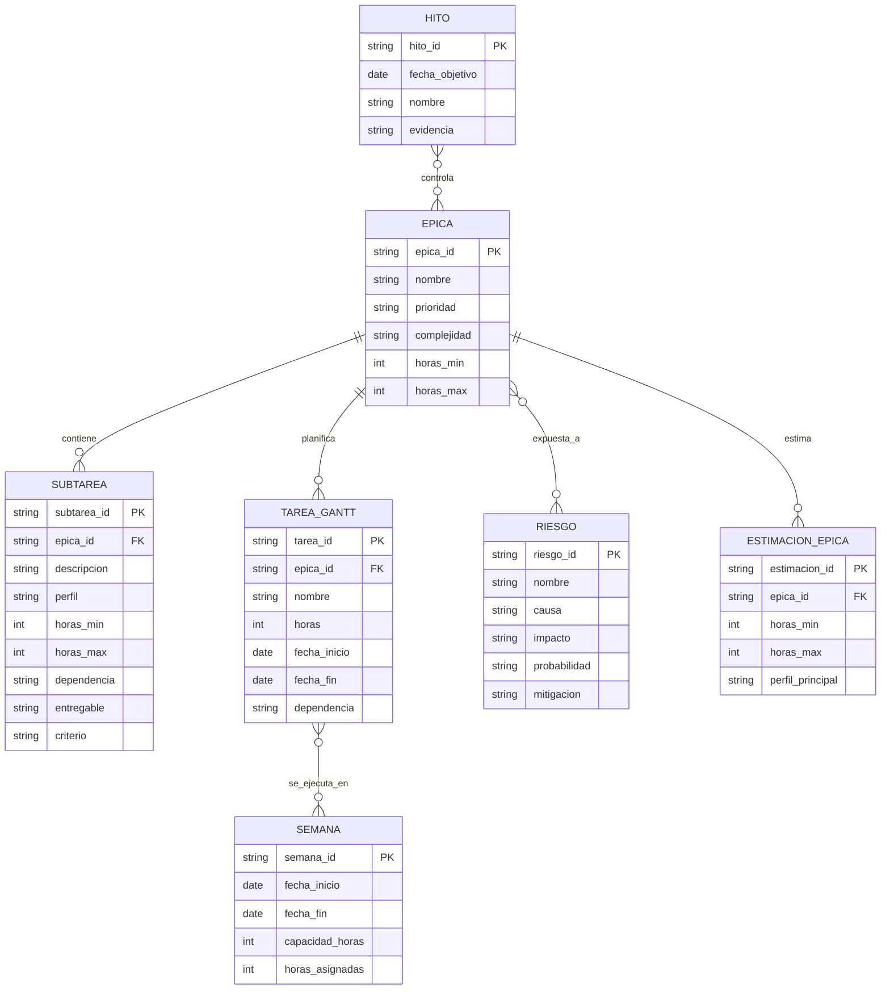

# Reporte funcional y tecnico de actualizacion

Proyecto: `RecursosCompartidos` / `UNED.Ami.sln`  
Fecha de analisis: 2026-06-08  
Alcance revisado: solucion `UNED.Ami.sln`, proyectos `.csproj`, configuraciones, servicios API, librerias compartidas, integraciones SAUR, frontend legacy `UNED.Ami.RUI`, pruebas unitarias y validacion de build local.

## 1. Resumen ejecutivo

El sistema `RecursosCompartidos` no corresponde a una sola aplicacion homogena, sino a una plataforma compartida con **21 proyectos compilables dentro de `UNED.Ami.sln`** y **2 proyectos de documentacion SHFB**, que agrupa API REST, librerias reutilizables, integraciones con Active Directory, AS400, SQL Server, servicios auxiliares, utilitarios SAUR y un frontend legacy ASP.NET MVC 5 bajo .NET Framework.

La solucion combina tres mundos tecnologicos en el mismo alcance:

- `netcoreapp2.2` en la mayor parte de API, BL, DAL, EL, DLLs y varios procesos SAUR.
- `netcoreapp3.1` en `UNED.Saur.CargaInicialEvalDes`.
- `.NET Framework 4.6.1` en `UNED.Ami.RUI`.

El estado tecnico general es **legacy, heterogeneo y de riesgo critico para modernizacion**. En el entorno actual, `dotnet build UNED.Ami.sln --no-restore` falla con **21 errores y 8 advertencias**. Los errores observados son de dos tipos principales:

- falta de `project.assets.json` en la mayoria de proyectos .NET Core, lo que confirma que el build depende de restauracion previa y pipeline/maquina con paquetes completos;
- error `MSB4019` en `UNED.Ami.RUI` por ausencia de `Microsoft.WebApplication.targets`, lo que confirma que este proyecto web legado no compila con `dotnet` CLI puro y requiere cadena de build de Visual Studio/MSBuild para aplicaciones web clasicas.

El riesgo principal no es solo la version EOL de .NET, sino la combinacion de:

- runtimes fuera de soporte,
- configuraciones sensibles expuestas,
- mezcla de ASP.NET Core y ASP.NET MVC clasico,
- dependencias de SQL Server, AS400, LDAP/AD y SAUR,
- y pruebas unitarias acopladas a credenciales o ambientes reales.

Prioridad general: **critica**. Recomendacion: ejecutar una modernizacion controlada por fases, iniciando por saneamiento de secretos, estabilizacion de build y definicion de estrategia para el frente legacy `UNED.Ami.RUI`, antes de una migracion mayor a version LTS vigente.

Referencias de soporte: [Microsoft .NET support policy](https://dotnet.microsoft.com/en-us/platform/support/policy/dotnet-core), [fin de soporte .NET Core 2.2](https://devblogs.microsoft.com/dotnet/net-core-2-2-will-reach-end-of-life-on-december-23-2019/), [fin de soporte .NET Core 3.1](https://devblogs.microsoft.com/dotnet/net-core-3-1-will-reach-end-of-support-on-december-13-2022/).

## 2. Diagnostico funcional

| Modulo | Funcion observada | Actualizacion requerida |
|---|---|---|
| API corporativa AMI | Servicios REST para Active Directory, AS400, auditoria, dependencias, oficinas, plazas, token, status y excepciones | Validar contratos, seguridad, versionado y compatibilidad de clientes |
| Librerias compartidas | DLLs para AD, AS400, Mail, validaciones y extensiones MVC | Revisar reutilizacion, compatibilidad y empaquetado |
| Acceso a datos | DAL sobre SQL Server con EF Core 2.2.6 y uso adicional de `SqlClient` | Modernizar acceso a datos y revisar rendimiento/compatibilidad |
| Integraciones SAUR | Cargas iniciales para SIPEU, PROMADE, SIGESCA, EvalDes y Tesoreria | Validar autenticacion, endpoints, logs y resiliencia |
| Frontend legacy RUI | Aplicacion ASP.NET MVC 5 / ReportViewer / SQL Server Types | Definir si se moderniza, aisla o sustituye gradualmente |
| Servicio de status | Servicio auxiliar con SignalR | Revisar necesidad real, version de SignalR y monitoreo |
| Utilitarios y demos | Proyecto de validaciones y demos de librerias | Separar activos de produccion de material demostrativo |
| Pruebas unitarias | Suite MSTest sobre mail, AD, HTTP y controladores API | Desacoplar pruebas de credenciales/ambientes reales |

## 3. Diagnostico tecnico

| Aspecto | Hallazgo | Riesgo |
|---|---|---|
| Version .NET | Predomina `netcoreapp2.2`, existe `netcoreapp3.1` y `net461` en la misma solucion | Critico por obsolescencia y complejidad de migracion |
| Compilacion actual | `dotnet build --no-restore` falla con 21 errores y 8 advertencias | Critico: no hay build portable estable en entorno actual |
| Cadena de build | `UNED.Ami.RUI` requiere `Microsoft.WebApplication.targets` y cadena MSBuild/Visual Studio | Alto: no compila con CLI moderna estandar |
| Datos | `UNED.Ami.DAL` usa EF Core 2.2.6 con SQL Server; otras piezas usan `System.Data.SqlClient` y AS400 por ODBC | Alto: heterogeneidad de acceso y dependencias viejas |
| Integraciones | Hay dependencias con LDAP/AD, SAUR, AS400 y servicios AMI externos | Alto: pruebas y despliegues dependen de terceros |
| Seguridad | Hay secretos visibles en `UNED.Ami.RUI/Web.config`, `UNED.Ami.UnitTests/Web.config` y `UNED.Ami.UnitTests/appsettings.json` | Critico: rotacion inmediata |
| Calidad de pruebas | Se identifican 41 `[TestMethod]`, pero varias pruebas usan credenciales reales o configuracion de ambiente | Alto: cobertura util limitada para CI/CD moderno |
| Paquetes | Versiones antiguas: EF Core 2.2.6, MVC 5.2.7, Newtonsoft 11/12, SignalR 1.1.0, MSTest 1.4.0 | Alto: obsolescencia y riesgo potencial de seguridad |
| Arquitectura | Solucion mezcla librerias compartidas, aplicaciones de negocio, demos, docs y procesos de carga | Medio/alto: frontera de alcance poco clara |
| Portabilidad | Se observan `HintPath` a `NuGetFallbackFolder` y paquetes/targets legacy | Medio/alto: build fragil y dependiente de maquina |

## 4. Que se debe actualizar y por que

| Elemento | Estado actual | Problema | Riesgo de no actualizar | Beneficio | Prioridad | Complejidad |
|---|---|---|---|---|---|---|
| Framework .NET | Mezcla de `netcoreapp2.2`, `netcoreapp3.1` y `net461` | Tecnologias fuera de soporte o legacy | Vulnerabilidades, deuda tecnica y build no portable | Plataforma soportada y mantenible | Alta | Alta |
| Paquetes NuGet | Versiones antiguas y heterogeneas | Posible deuda de seguridad/compatibilidad | Fallos y bloqueos en migracion | Base tecnica moderna | Alta | Alta |
| Build y restore | No compila con `--no-restore`; RUI depende de targets VS | Pipeline fragil | Incapacidad de automatizar CI/CD | Build reproducible | Alta | Alta |
| `UNED.Ami.RUI` | ASP.NET MVC 5 en `.NET Framework 4.6.1` | Aplicacion separada del resto moderno | Punto de bloqueo para modernizacion global | Frontera clara de modernizacion | Alta | Alta |
| Secretos y credenciales | Valores sensibles visibles en archivos de configuracion | Exposicion directa | Compromiso de SQL, SAUR, AD y cuentas de servicio | Gobierno de secretos y trazabilidad | Alta | Media |
| Integraciones externas | AD, SAUR, AS400 y endpoints AMI | Dependencias de terceros y ambientes | Fallas operativas o pruebas inconsistentes | Mayor resiliencia y observabilidad | Alta | Alta |
| DAL SQL Server | EF Core 2.2.6 y `SqlClient` legacy | Obsolescencia y acoplamiento | Riesgo de compatibilidad futura | Acceso a datos actualizado | Media | Media |
| Pruebas | 41 test methods con dependencia de ambiente | Baja portabilidad del set de pruebas | Regresiones no detectadas en CI | Pruebas automatizadas confiables | Alta | Media |
| Separacion de alcance | Demos, docs y proyectos auxiliares mezclados en la solucion | Ruido para mantenimiento | Estimaciones y builds poco claros | Solucion mas gobernable | Media | Media |
| Despliegue | Mezcla de ASP.NET Core y Web.config clasico | Procedimientos distintos por app | Errores de publicacion | Estrategia operativa consistente | Media | Alta |

## 5. Estimacion de horas hombre sin IA

| Tarea | Perfil | Min | Max | Justificacion |
|---|---:|---:|---:|---|
| Analisis inicial y levantamiento | Arquitecto / Analista | 56 | 88 | Solucion amplia, 21 proyectos, integraciones y alcance mixto |
| Revision de codigo y dependencias | Senior | 72 | 120 | API, librerias, SAUR, RUI legacy y pruebas |
| Documentacion funcional | Analista funcional | 48 | 84 | Servicios, integraciones y frontend/reporteria |
| Documentacion tecnica | Arquitecto / Senior | 48 | 80 | Arquitectura mixta, build y despliegue |
| Actualizacion .NET/NuGet | Senior / Arquitecto | 180 | 320 | Mezcla de runtimes y paquetes heredados |
| Seguridad y secretos | Senior / DevOps | 100 | 180 | SQL, SAUR, AD, cuentas tecnicas y configuraciones expuestas |
| Refactorizacion arquitectura | Senior / Arquitecto | 120 | 220 | Separacion de alcance, build y dependencias compartidas |
| Modernizacion o estabilizacion de `UNED.Ami.RUI` | Senior .NET / Arquitecto | 120 | 240 | Proyecto MVC 5 / WebApplication / ReportViewer |
| Integraciones y acceso a datos | Senior / DBA / Integraciones | 100 | 180 | SQL Server, AS400, LDAP y SAUR |
| Pruebas unitarias | Developer / QA tecnico | 90 | 160 | Desacoplar y ampliar suite existente |
| Pruebas funcionales | QA / Analista | 100 | 180 | API, RUI e integraciones principales |
| Correccion de errores | Senior / Intermedio | 90 | 160 | Incidencias posteriores a migracion |
| Validacion usuarios | Analista / QA | 32 | 64 | UAT y ajustes finales |
| Publicacion pruebas | DevOps | 32 | 56 | Ambiente QA para stack mixto |
| Publicacion produccion | DevOps / Senior | 24 | 40 | Paso a produccion y monitoreo inicial |
| Documentacion final | Analista / Senior | 24 | 40 | Cierre, runbooks y bitacora |

Total estimado: **1.236 a 2.232 horas hombre**.

## 6. Primer reporte: tareas epicas

| Codigo | Epica | Descripcion funcional | Justificacion | Prioridad | Complejidad | Perfil | Min | Max | Riesgo si no se realiza | Resultado |
|---|---|---|---|---|---|---|---:|---:|---|---|
| EP-01 | Analisis funcional y tecnico | Inventario completo de la solucion compartida | Base del plan realista | P1 | Media | Arquitecto/Analista | 56 | 88 | Alcance difuso | Diagnostico aprobado |
| EP-02 | Actualizacion de framework y dependencias | Modernizar runtimes y paquetes | Solucion mixta y obsoleta | P1 | Alta | Senior/Arquitecto | 200 | 360 | Bloqueo tecnico y seguridad | Plataforma modernizada |
| EP-03 | Seguridad y secretos | Retiro y rotacion de credenciales expuestas | Secretos visibles en configuracion | P1 | Alta | Senior/DevOps | 120 | 200 | Compromiso de accesos | Configuracion saneada |
| EP-04 | Arquitectura y gobernanza | Ordenar alcance, referencias y empaquetado | Solucion con piezas heterogeneas | P2 | Alta | Arquitecto | 140 | 260 | Mantenimiento fragil | Estructura mas limpia |
| EP-05 | Frontend legacy y build mixto | Definir y ejecutar estrategia para `UNED.Ami.RUI` | Proyecto web clasico bloquea build moderno | P1 | Alta | Senior/Arquitecto | 140 | 300 | Pipeline incompleto | RUI estabilizada o aislada |
| EP-06 | Integraciones y datos | Validar SQL Server, AS400, AD y SAUR | Dependencia externa alta | P2 | Alta | Senior/DBA/Integraciones | 140 | 240 | Fallos operativos | Integraciones validadas |
| EP-07 | Pruebas | Fortalecer pruebas unitarias y funcionales | Suite actual dependiente de ambiente | P1 | Alta | QA/Dev | 220 | 420 | Regresion no detectada | Suite minima confiable |
| EP-08 | Documentacion | Documentacion funcional, tecnica y operativa | Transferencia de conocimiento | P3 | Media | Analista/Senior | 100 | 172 | Soporte dificil | Documentacion formal |
| EP-09 | Preparacion despliegue | QA, produccion y runbooks | Stack mixto requiere despliegue diferenciado | P2 | Media | DevOps | 84 | 120 | Paso a produccion riesgoso | Procedimiento repetible |
| EP-10 | Validacion final | UAT y cierre | Confirmar operacion post actualizacion | P2 | Media | Analista/QA | 36 | 72 | Rechazo de usuarios | Acta de aceptacion |

## 7. Segundo reporte: epicas con subtareas

| Epica | Subtarea | Descripcion | Motivo | Perfil | Min | Max | Dependencia | Entregable | Criterio |
|---|---|---|---|---|---:|---:|---|---|---|
| EP-01 | ST-01 | Inventariar proyectos, carpetas y tipos de aplicacion | Delimitar alcance | Arquitecto | 20 | 32 | Codigo | Inventario de solucion | Validado por lider |
| EP-01 | ST-02 | Clasificar modulos productivos, auxiliares y demo | Gobernanza | Analista | 16 | 24 | ST-01 | Matriz de alcance | Aprobada |
| EP-01 | ST-03 | Levantar flujos funcionales criticos | Mapa funcional | Analista | 20 | 32 | Usuarios clave | Matriz funcional | Cobertura base |
| EP-02 | ST-01 | Definir ruta de migracion por tecnologia | Modernizacion | Arquitecto | 28 | 44 | EP-01 | Estrategia de ruta | Aprobada |
| EP-02 | ST-02 | Actualizar paquetes base y restauracion | Seguridad/compatibilidad | Senior | 48 | 88 | ST-01 | Rama tecnica | Restore controlado |
| EP-02 | ST-03 | Migrar proyectos .NET Core de menor riesgo | Ejecucion | Senior | 60 | 108 | ST-02 | Proyectos modernizados | Build parcial |
| EP-02 | ST-04 | Resolver incompatibilidades post migracion | Compilacion | Senior | 64 | 120 | ST-03 | Solucion estabilizada | Errores reducidos |
| EP-03 | ST-01 | Inventariar secretos y configuraciones sensibles | Riesgo | DevOps | 16 | 28 | EP-01 | Matriz de secretos | Sin publicar valores |
| EP-03 | ST-02 | Retirar secretos de archivos del repo | Contencion | DevOps | 28 | 44 | ST-01 | Config segura | Sin secretos activos |
| EP-03 | ST-03 | Rotar credenciales expuestas | Mitigacion | DevOps/Sistemas | 32 | 60 | ST-02 | Credenciales nuevas | Validado por sistemas |
| EP-03 | ST-04 | Revisar token, acceso y cuentas tecnicas | Seguridad | Senior | 24 | 40 | ST-03 | Matriz de acceso | Pruebas de acceso |
| EP-04 | ST-01 | Separar alcance productivo de demo/docs | Orden | Arquitecto | 24 | 40 | EP-01 | Propuesta de segmentacion | Revisada |
| EP-04 | ST-02 | Revisar referencias, `HintPath` y dependencias heredadas | Portabilidad | Senior | 40 | 72 | ST-01 | Matriz tecnica | Sin referencias fragiles criticas |
| EP-04 | ST-03 | Normalizar inyeccion y configuracion compartida | Mantenibilidad | Senior | 32 | 56 | ST-02 | Servicios revisados | Revision tecnica |
| EP-05 | ST-01 | Evaluar estrategia para `UNED.Ami.RUI` | Decision arquitectonica | Arquitecto | 24 | 40 | EP-01 | Documento de decision | Ruta aprobada |
| EP-05 | ST-02 | Estabilizar build legacy y dependencias web | Build mixto | Senior | 48 | 96 | ST-01 | Build documentado | Compilacion controlada |
| EP-05 | ST-03 | Revisar reporteria, SQL Server Types y MVC 5 | Compatibilidad | Senior | 40 | 84 | ST-02 | Matriz de riesgos RUI | Flujo base validado |
| EP-06 | ST-01 | Validar DAL SQL Server y EF Core | Datos | DBA/Senior | 32 | 52 | EP-02 | Matriz DAL | Casos base |
| EP-06 | ST-02 | Validar integracion AS400/ODBC | Externa | Senior/Integraciones | 24 | 48 | Ambientes | Evidencia tecnica | Conexion validada |
| EP-06 | ST-03 | Validar AD/LDAP | Seguridad | Senior/Infra | 24 | 44 | Ambientes | Evidencia AD | Casos aprobados |
| EP-06 | ST-04 | Validar integraciones SAUR | Externa | Senior/QA | 28 | 52 | Ambientes | Evidencia SAUR | Endpoints probados |
| EP-07 | ST-01 | Definir estrategia de pruebas moderna | Cobertura | QA | 20 | 28 | EP-01 | Plan QA | Aprobado |
| EP-07 | ST-02 | Desacoplar pruebas dependientes de ambiente | Portabilidad | Dev/QA | 40 | 76 | ST-01 | Suite depurada | Ejecutable local/CI |
| EP-07 | ST-03 | Crear pruebas unitarias adicionales | Regresion | Dev/QA | 60 | 120 | EP-02/EP-06 | Suite ampliada | Cobertura minima |
| EP-07 | ST-04 | Ejecutar regresion funcional completa | Validacion | QA/Analista | 100 | 196 | Ambiente QA | Evidencia QA | Casos cerrados |
| EP-08 | ST-01 | Documentar arquitectura y build | Transferencia | Arquitecto | 32 | 56 | EP-04/EP-05 | Documento tecnico | Revisado |
| EP-08 | ST-02 | Documentar operacion e integraciones | Soporte | Analista/Senior | 36 | 60 | EP-06 | Manual operativo | Aprobado |
| EP-09 | ST-01 | Preparar ambiente QA y pipeline | Despliegue | DevOps | 36 | 56 | EP-02/EP-05 | Ambiente listo | Smoke test |
| EP-09 | ST-02 | Preparar paso a produccion y rollback | Operacion | DevOps/Senior | 48 | 64 | UAT | Plan despliegue | Rollback definido |
| EP-10 | ST-01 | Validacion con usuarios clave | Aceptacion | Analista/QA | 24 | 48 | EP-07 | Acta UAT | Firmada |
| EP-10 | ST-02 | Cierre y lecciones aprendidas | Gobierno | Analista | 12 | 24 | ST-01 | Informe de cierre | Aprobado |

Total subtareas detalladas: **30**.

## 8. Matriz de priorizacion

| Epica | Impacto funcional | Impacto tecnico | Riesgo operativo | Esfuerzo | Urgencia | Prioridad |
|---|---|---|---|---|---|---|
| EP-02 | Alto | Alto | Alto | Alto | Alta | P1 critica |
| EP-03 | Alto | Alto | Alto | Medio/Alto | Alta | P1 critica |
| EP-05 | Alto | Alto | Alto | Alto | Alta | P1 critica |
| EP-07 | Alto | Alto | Alto | Alto | Alta | P1 critica |
| EP-06 | Alto | Alto | Alto | Medio/Alto | Alta | P2 importante |
| EP-04 | Medio | Alto | Medio/Alto | Alto | Media | P2 importante |
| EP-09 | Medio | Alto | Alto | Medio | Media | P2 importante |
| EP-10 | Alto | Medio | Medio | Bajo | Media | P2 importante |
| EP-01 | Medio | Medio | Medio | Medio | Alta | P2 importante |
| EP-08 | Medio | Medio | Bajo | Medio | Baja | P3 recomendable |

### Costo estimado en horas de tareas criticas

La siguiente tabla separa las epicas clasificadas como **P1 critica**, indicando el costo estimado en horas hombre para su ejecucion manual, sin intervencion de inteligencia artificial.

| Epica | Nombre de la epica | Impacto funcional | Impacto tecnico | Riesgo operativo | Esfuerzo | Urgencia | Prioridad | Horas minimas | Horas maximas | Perfil principal |
|---|---|---|---|---|---|---|---|---:|---:|---|
| EP-02 | Actualizacion de framework y dependencias | Alto | Alto | Alto | Alto | Alta | P1 critica | 200 | 360 | Arquitecto / Desarrollador senior .NET |
| EP-03 | Seguridad y secretos | Alto | Alto | Alto | Medio/Alto | Alta | P1 critica | 120 | 200 | DevOps / Senior .NET |
| EP-05 | Frontend legacy y build mixto | Alto | Alto | Alto | Alto | Alta | P1 critica | 140 | 300 | Arquitecto / Senior .NET |
| EP-07 | Pruebas | Alto | Alto | Alto | Alto | Alta | P1 critica | 220 | 420 | QA / Desarrollador .NET |

| Indicador | Horas |
|---|---:|
| Total minimo tareas criticas | 680 |
| Total maximo tareas criticas | 1.280 |

### Detalle operativo para historias de usuario y sprints

La siguiente tabla descompone las epicas criticas en tareas base para iniciar la creacion de historias de usuario, criterios de aceptacion y planificacion de sprints. La propuesta asume sprints de 2 semanas y debe ajustarse segun disponibilidad real del equipo, acceso a ambientes, dependencias institucionales y prioridad definida por la jefatura del proyecto.

| Epica | Sprint sugerido | Tarea base para historia de usuario | Enfoque de historia de usuario | Perfil responsable | Horas minimas | Horas maximas | Dependencias | Entregable esperado | Criterio base de aceptacion |
|---|---|---|---|---|---:|---:|---|---|---|
| EP-03 | Sprint 1 | Inventariar secretos y configuraciones sensibles | Como equipo tecnico, necesito identificar configuraciones expuestas para definir el plan de mitigacion. | DevOps / Senior .NET | 8 | 16 | Acceso al codigo | Matriz de secretos | Inventario validado |
| EP-03 | Sprint 1 | Retirar secretos de `Web.config` y `appsettings` | Como administrador tecnico, necesito sacar credenciales del repositorio para reducir el riesgo de exposicion. | DevOps | 16 | 28 | Matriz de secretos | Configuracion externa/segura | No quedan secretos activos en repo |
| EP-03 | Sprint 1 | Rotar credenciales expuestas | Como responsable de seguridad, necesito invalidar credenciales comprometidas para recuperar control operativo. | DevOps / Sistemas externos | 24 | 48 | Coordinacion institucional | Credenciales nuevas | Credenciales anteriores invalidadas |
| EP-03 | Sprint 2 | Revisar tokens, usuarios tecnicos y permisos | Como responsable tecnico, necesito validar accesos y cuentas de servicio para proteger integraciones. | Senior .NET | 20 | 32 | Configuracion saneada | Matriz de acceso | Reglas validadas |
| EP-02 | Sprint 2 | Definir ruta de modernizacion por tipo de proyecto | Como arquitecto, necesito una estrategia diferenciada para .NET Core, .NET Framework y librerias. | Arquitecto .NET | 16 | 28 | Inventario tecnico | Documento de ruta | Ruta aprobada |
| EP-02 | Sprint 2 | Normalizar estrategia de restore y paquetes | Como desarrollador, necesito poder restaurar y compilar los proyectos en un entorno reproducible. | Senior .NET | 20 | 36 | Ruta tecnica | Estrategia de restore | Restore controlado |
| EP-02 | Sprint 3 | Actualizar proyectos .NET Core prioritarios | Como equipo tecnico, necesito modernizar primero las piezas de menor friccion para reducir riesgo incremental. | Senior .NET | 40 | 72 | Restore validado | Proyectos actualizados | Build parcial exitoso |
| EP-02 | Sprint 4 | Resolver incompatibilidades de framework y middleware | Como desarrollador, necesito corregir incompatibilidades para estabilizar API y librerias. | Senior .NET | 40 | 72 | Migracion inicial | Solucion estabilizada | API/librerias arrancan |
| EP-05 | Sprint 4 | Definir estrategia sobre `UNED.Ami.RUI` | Como arquitecto, necesito decidir si se migra, se aísla o se mantiene controlado el frontend legacy. | Arquitecto / Senior .NET | 16 | 28 | Diagnostico tecnico | Decision arquitectonica | Ruta aprobada |
| EP-05 | Sprint 5 | Estabilizar build de `UNED.Ami.RUI` | Como equipo tecnico, necesito compilar y publicar el proyecto legacy de forma controlada. | Senior .NET / Build Engineer | 32 | 60 | Estrategia aprobada | Build documentado | Build repetible |
| EP-05 | Sprint 5 | Revisar reportes y dependencias web clasicas | Como mantenedor, necesito asegurar la continuidad de reportes y dependencias MVC 5. | Senior .NET | 24 | 44 | Build RUI | Matriz de compatibilidad | Flujo base validado |
| EP-07 | Sprint 1 | Definir plan de pruebas criticas | Como QA, necesito saber que escenarios son obligatorios para validar la modernizacion. | QA / Analista funcional | 16 | 24 | Inventario funcional | Plan QA | Aprobado |
| EP-07 | Sprint 3 | Desacoplar pruebas dependientes de ambiente | Como desarrollador, necesito que la suite no dependa de credenciales reales para integrarla en CI. | Dev / QA tecnico | 24 | 44 | Plan QA | Suite depurada | Pruebas ejecutables |
| EP-07 | Sprint 4 | Crear pruebas unitarias para API y librerias criticas | Como equipo tecnico, necesito automatizar validaciones minimas sobre servicios y librerias. | Dev .NET / QA | 40 | 80 | Servicios estabilizados | Suite inicial ampliada | Cobertura minima |
| EP-07 | Sprint 6 | Ejecutar regresion funcional completa | Como equipo de proyecto, necesito confirmar que API, RUI e integraciones siguen operando. | QA / Analista funcional | 48 | 90 | Ambiente QA | Evidencia de pruebas | Defectos registrados |
| EP-07 | Sprint 7 | Corregir defectos detectados | Como desarrollador, necesito corregir incidencias para estabilizar la version candidata. | Senior .NET / Intermedio | 40 | 72 | Resultado regresion | Defectos corregidos | Criticos cerrados |
| EP-07 | Sprint 7 | Validacion final con usuarios clave | Como usuario clave, necesito validar los servicios actualizados antes de produccion. | Analista / QA | 16 | 28 | Defectos criticos cerrados | Evidencia UAT | Aprobacion o hallazgos documentados |

| Indicador de planificacion critica | Valor estimado |
|---|---:|
| Total tareas base para historias | 17 |
| Sprints sugeridos | 7 |
| Horas minimas plan operativo critico | 498 |
| Horas maximas plan operativo critico | 874 |

Nota: el rango operativo puede diferir del resumen de epicas criticas porque incluye actividades de preparacion de entorno, build legacy, evidencias y estabilizacion incremental.

## 9. Riesgos del proyecto

| Riesgo | Causa probable | Impacto | Probabilidad | Mitigacion |
|---|---|---|---|---|
| Frameworks fuera de soporte | `netcoreapp2.2`, `netcoreapp3.1` y componentes legacy | Alto | Alta | Migracion por fases a versiones soportadas |
| Build no reproducible | Restore incompleto y targets web legacy ausentes | Alto | Alta | Estandarizar restore/build y documentar toolchain |
| Secretos expuestos | Credenciales en `Web.config` y pruebas | Critico | Alta | Rotar y mover a vault/variables |
| Bloqueo por `UNED.Ami.RUI` | Proyecto MVC 5 / WebApplication heredado | Alto | Alta | Estrategia explicita de aislamiento o modernizacion |
| Regresion funcional | Integraciones externas y baja portabilidad de pruebas | Alto | Alta | Plan QA y pruebas desacopladas |
| Fallos en integraciones | Dependencias con AD, SAUR, AS400 y SQL | Alto | Media | Ambientes de prueba y validaciones por contrato |
| Dependencias legacy | Paquetes y `HintPath` heredados | Medio/Alto | Media | Limpieza de referencias y upgrade controlado |
| Alcance ambiguo | Mezcla de apps productivas, demos y docs en la solucion | Medio | Media | Gobernanza y segmentacion de alcance |

## 10. Supuestos de estimacion

La estimacion considera como alcance principal la solucion `UNED.Ami.sln` y sus proyectos integrados. Se asume acceso al codigo fuente, a ambientes de prueba para SQL Server, AD, SAUR y AS400, asi como apoyo de infraestructura para rotacion de credenciales y definicion de estrategia de despliegue. No se incluyen proyectos adicionales del repositorio que no aparecen en `UNED.Ami.sln`, como utilitarios o proyectos sueltos fuera de la solucion principal.

En el entorno actual no se ejecuto una restauracion completa ni una auditoria automatizada de vulnerabilidades NuGet. Por ello, el estado de build se fundamenta en `dotnet build --no-restore`, que evidencia fragilidad de toolchain pero no sustituye una validacion integral en ambiente controlado con restore, Visual Studio/MSBuild y dependencias completas.

No se incluyen redisenos funcionales mayores, cambios de experiencia de usuario ni reingenieria completa de integraciones externas. Si la decision institucional fuera retirar o reescribir `UNED.Ami.RUI`, la estimacion deberia revisarse por separado.

## 11. Resultado final

| Indicador | Resultado |
|---|---|
| Solucion principal revisada | `UNED.Ami.sln` |
| Total de proyectos compilables en la solucion | 21 |
| Proyectos adicionales de documentacion | 2 |
| Total de subtareas detalladas | 30 |
| Total minimo estimado | 1.236 horas |
| Total maximo estimado | 2.232 horas |
| Build local observado | 21 errores y 8 advertencias con `dotnet build --no-restore` |
| Perfil mas requerido | Arquitecto / Desarrollador senior .NET |
| Nivel general de riesgo | Alto / Critico por stack mixto, secretos y obsolescencia |
| Recomendacion final | Modernizacion controlada, empezando por seguridad, build y estrategia de `UNED.Ami.RUI` |
| Orden recomendado | EP-01, EP-03, EP-02, EP-05, EP-06, EP-04, EP-07, EP-09, EP-10, EP-08 |

## Evidencia tecnica local usada

- `Recursos Compartidos/RecursosCompartidos/UNED.Ami.sln`: 21 proyectos de codigo y 2 de documentacion.
- `Recursos Compartidos/RecursosCompartidos/Services/UNED.Ami.API/Startup.cs`: API ASP.NET Core 2.2 con configuraciones de DI, token y Swagger.
- `Recursos Compartidos/RecursosCompartidos/UNED.Ami.DAL/UNED.Ami.DAL.csproj`: EF Core 2.2.6 y SQL Server.
- `Recursos Compartidos/RecursosCompartidos/UNED.Ami.RUI/UNED.Ami.RUI.csproj`: proyecto web MVC 5 / .NET Framework 4.6.1 con `Microsoft.WebApplication.targets`.
- `Recursos Compartidos/RecursosCompartidos/UNED.Ami.RUI/Web.config`: conexion SQL y multiples credenciales visibles.
- `Recursos Compartidos/RecursosCompartidos/UNED.Ami.UnitTests/appsettings.json` y `Web.config`: credenciales AD/SQL/AMI/SAUR visibles en pruebas.
- `dotnet build Recursos Compartidos/RecursosCompartidos/UNED.Ami.sln --no-restore`: 21 errores, 8 advertencias.

## 12. Cronograma tipo Gantt para EP-03, EP-02, EP-05 y EP-07

Este cronograma se ajusta a la jornada indicada por el programador: **6 horas funcionales por dia, 5 dias por semana**, para una capacidad semanal de **30 horas**. La planificacion se calcula como trabajo principalmente ejecutado por una persona programadora, con apoyo puntual de DevOps, QA, infraestructura y responsables de integraciones cuando sea necesario.

Periodo propuesto: lunes 2026-06-08 al viernes 2026-11-27.  
Duracion total: 25 semanas.  
Capacidad semanal: 30 horas.  
Capacidad total disponible: 750 horas.  
Esfuerzo planificado: **742 horas**.  
Reserva tecnica aproximada: **8 horas**.

### Resumen de esfuerzo por epica

| Epica | Nombre | Horas planificadas | Semanas principales | Resultado esperado |
|---|---|---:|---|---|
| EP-03 | Seguridad y secretos | 108 | S1 a S5 | Secretos retirados, credenciales rotadas y accesos revisados |
| EP-02 | Framework y dependencias | 232 | S4 a S13 | Ruta tecnica definida, restore controlado y proyectos .NET Core estabilizados |
| EP-05 | Frontend legacy y build mixto | 114 | S9 a S15 | Estrategia y build controlado para `UNED.Ami.RUI` |
| EP-07 | Pruebas | 288 | S1 a S25 | Plan QA, suite depurada, regresion y UAT |
| **Total** | **EP-03, EP-02, EP-05 y EP-07** | **742** | **25 semanas** | **Version candidata validada tecnicamente** |

### Semanas del cronograma

| Semana | Fechas | Capacidad |
|---|---|---:|
| S1 | 2026-06-08 al 2026-06-12 | 30 h |
| S2 | 2026-06-15 al 2026-06-19 | 30 h |
| S3 | 2026-06-22 al 2026-06-26 | 30 h |
| S4 | 2026-06-29 al 2026-07-03 | 30 h |
| S5 | 2026-07-06 al 2026-07-10 | 30 h |
| S6 | 2026-07-13 al 2026-07-17 | 30 h |
| S7 | 2026-07-20 al 2026-07-24 | 30 h |
| S8 | 2026-07-27 al 2026-07-31 | 30 h |
| S9 | 2026-08-03 al 2026-08-07 | 30 h |
| S10 | 2026-08-10 al 2026-08-14 | 30 h |
| S11 | 2026-08-17 al 2026-08-21 | 30 h |
| S12 | 2026-08-24 al 2026-08-28 | 30 h |
| S13 | 2026-08-31 al 2026-09-04 | 30 h |
| S14 | 2026-09-07 al 2026-09-11 | 30 h |
| S15 | 2026-09-14 al 2026-09-18 | 30 h |
| S16 | 2026-09-21 al 2026-09-25 | 30 h |
| S17 | 2026-09-28 al 2026-10-02 | 30 h |
| S18 | 2026-10-05 al 2026-10-09 | 30 h |
| S19 | 2026-10-12 al 2026-10-16 | 30 h |
| S20 | 2026-10-19 al 2026-10-23 | 30 h |
| S21 | 2026-10-26 al 2026-10-30 | 30 h |
| S22 | 2026-11-02 al 2026-11-06 | 30 h |
| S23 | 2026-11-09 al 2026-11-13 | 30 h |
| S24 | 2026-11-16 al 2026-11-20 | 30 h |
| S25 | 2026-11-23 al 2026-11-27 | 30 h |

### Cronograma tipo Gantt por tarea

Leyenda: `X` = semana con trabajo planificado.

| ID | Epica | Tarea | Horas | Inicio | Fin | Dependencia | S1 | S2 | S3 | S4 | S5 | S6 | S7 | S8 | S9 | S10 | S11 | S12 | S13 | S14 | S15 | S16 | S17 | S18 | S19 | S20 | S21 | S22 | S23 | S24 | S25 |
|---|---|---|---:|---|---|---|---|---|---|---|---|---|---|---|---|---|---|---|---|---|---|---|---|---|---|---|---|---|---|---|---|
| T01 | EP-03 | Inventariar secretos y configuraciones sensibles | 12 | 2026-06-08 | 2026-06-12 | Codigo fuente | X |  |  |  |  |  |  |  |  |  |  |  |  |  |  |  |  |  |  |  |  |  |  |  |  |
| T02 | EP-07 | Definir plan de pruebas criticas | 18 | 2026-06-08 | 2026-06-19 | Inventario | X | X |  |  |  |  |  |  |  |  |  |  |  |  |  |  |  |  |  |  |  |  |  |  |  |
| T03 | EP-03 | Retirar secretos de configuracion | 24 | 2026-06-15 | 2026-06-26 | T01 |  | X | X |  |  |  |  |  |  |  |  |  |  |  |  |  |  |  |  |  |  |  |  |  |  |
| T04 | EP-03 | Rotar credenciales expuestas | 40 | 2026-06-22 | 2026-07-10 | T01, externos |  |  | X | X | X |  |  |  |  |  |  |  |  |  |  |  |  |  |  |  |  |  |  |  |  |
| T05 | EP-03 | Revisar token, acceso y cuentas tecnicas | 32 | 2026-06-29 | 2026-07-17 | T03 |  |  |  | X | X | X |  |  |  |  |  |  |  |  |  |  |  |  |  |  |  |  |  |  |  |
| T06 | EP-02 | Definir ruta de modernizacion mixta | 24 | 2026-06-29 | 2026-07-10 | Diagnostico |  |  |  | X | X |  |  |  |  |  |  |  |  |  |  |  |  |  |  |  |  |  |  |  |  |
| T07 | EP-02 | Estrategia de restore y paquetes base | 40 | 2026-07-13 | 2026-07-31 | T06 |  |  |  |  |  | X | X | X |  |  |  |  |  |  |  |  |  |  |  |  |  |  |  |  |  |
| T08 | EP-02 | Migrar librerias .NET Core de menor riesgo | 60 | 2026-07-27 | 2026-08-21 | T07 |  |  |  |  |  |  |  | X | X | X | X |  |  |  |  |  |  |  |  |  |  |  |  |  |  |
| T09 | EP-02 | Estabilizar API, Status y dependencias comunes | 48 | 2026-08-10 | 2026-09-04 | T08 |  |  |  |  |  |  |  |  |  | X | X | X | X |  |  |  |  |  |  |  |  |  |  |  |  |
| T10 | EP-05 | Definir estrategia para `UNED.Ami.RUI` | 24 | 2026-08-17 | 2026-08-28 | T06 |  |  |  |  |  |  |  |  |  |  | X | X |  |  |  |  |  |  |  |  |  |  |  |  |  |
| T11 | EP-05 | Estabilizar build de `UNED.Ami.RUI` | 50 | 2026-08-31 | 2026-09-25 | T10 |  |  |  |  |  |  |  |  |  |  |  |  | X | X | X | X |  |  |  |  |  |  |  |  |  |
| T12 | EP-02 | Refactor de referencias fragiles y `HintPath` | 40 | 2026-09-07 | 2026-09-25 | T09 |  |  |  |  |  |  |  |  |  |  |  |  |  | X | X | X |  |  |  |  |  |  |  |  |  |
| T13 | EP-06 | Validar SQL Server, AS400, AD y SAUR | 44 | 2026-09-21 | 2026-10-09 | T09, ambientes |  |  |  |  |  |  |  |  |  |  |  |  |  |  |  | X | X | X |  |  |  |  |  |  |  |
| T14 | EP-02 | Documentacion tecnica de plataforma | 12 | 2026-09-28 | 2026-10-02 | T09, T11 |  |  |  |  |  |  |  |  |  |  |  |  |  |  |  |  | X |  |  |  |  |  |  |  |  |
| T15 | EP-07 | Disenar casos funcionales API, RUI e integraciones | 36 | 2026-09-28 | 2026-10-16 | T02 |  |  |  |  |  |  |  |  |  |  |  |  |  |  |  |  | X | X | X |  |  |  |  |  |  |
| T16 | EP-07 | Desacoplar y ampliar pruebas unitarias | 60 | 2026-10-05 | 2026-10-30 | T08, T09 |  |  |  |  |  |  |  |  |  |  |  |  |  |  |  |  |  | X | X | X | X |  |  |  |  |
| T17 | EP-07 | Preparar datos de prueba y checklist | 24 | 2026-10-12 | 2026-10-23 | T15 |  |  |  |  |  |  |  |  |  |  |  |  |  |  |  |  |  |  | X | X |  |  |  |  |  |
| T18 | EP-07 | Ejecutar regresion funcional completa en QA | 68 | 2026-10-19 | 2026-11-06 | T13, T17 |  |  |  |  |  |  |  |  |  |  |  |  |  |  |  |  |  |  |  | X | X | X |  |  |  |
| T19 | EP-07 | Corregir defectos detectados | 62 | 2026-11-02 | 2026-11-20 | T18 |  |  |  |  |  |  |  |  |  |  |  |  |  |  |  |  |  |  |  |  |  | X | X | X |  |
| T20 | EP-07 | Reejecucion, UAT y cierre | 30 | 2026-11-16 | 2026-11-27 | T19 |  |  |  |  |  |  |  |  |  |  |  |  |  |  |  |  |  |  |  |  |  |  | X | X | X |

### Carga semanal ajustada a 6 horas funcionales diarias

| Semana | Fechas | Horas asignadas | Capacidad semanal | Diferencia | Enfoque | Descripcion para seguimiento gerencial |
|---|---|---:|---:|---:|---|---|
| S1 | 2026-06-08 al 2026-06-12 | 30,0 | 30 | 0,0 | Seguridad inicial y QA | Se identifica configuracion sensible y se define el plan inicial de pruebas criticas |
| S2 | 2026-06-15 al 2026-06-19 | 30,0 | 30 | 0,0 | Saneamiento inicial | Se retiran secretos visibles y se clasifica el riesgo tecnico de acceso |
| S3 | 2026-06-22 al 2026-06-26 | 30,0 | 30 | 0,0 | Rotacion y contencion | Se coordinan cambios de credenciales expuestas con las areas responsables |
| S4 | 2026-06-29 al 2026-07-03 | 30,0 | 30 | 0,0 | Ruta tecnica y seguridad | Se revisan accesos tecnicos y se define la estrategia de modernizacion mixta |
| S5 | 2026-07-06 al 2026-07-10 | 30,0 | 30 | 0,0 | Cierre seguridad base | Se terminan ajustes de seguridad y se consolida la ruta tecnica |
| S6 | 2026-07-13 al 2026-07-17 | 30,0 | 30 | 0,0 | Restore y dependencias | Se trabaja en estrategia de paquetes y restauracion reproducible |
| S7 | 2026-07-20 al 2026-07-24 | 30,0 | 30 | 0,0 | Dependencias base | Se actualizan dependencias y se estabiliza la base tecnica de restore |
| S8 | 2026-07-27 al 2026-07-31 | 30,0 | 30 | 0,0 | Inicio migracion .NET Core | Se migran librerias y proyectos de menor riesgo |
| S9 | 2026-08-03 al 2026-08-07 | 30,0 | 30 | 0,0 | Migracion .NET Core | Se continua la actualizacion de librerias y capas compartidas |
| S10 | 2026-08-10 al 2026-08-14 | 30,0 | 30 | 0,0 | API y dependencias comunes | Se estabilizan API, servicio de status y piezas comunes |
| S11 | 2026-08-17 al 2026-08-21 | 30,0 | 30 | 0,0 | Build core y decision RUI | Se consolida la migracion core y se define ruta para el frontend legacy |
| S12 | 2026-08-24 al 2026-08-28 | 30,0 | 30 | 0,0 | Estrategia RUI | Se analiza el frente MVC 5 y sus dependencias de build/publicacion |
| S13 | 2026-08-31 al 2026-09-04 | 30,0 | 30 | 0,0 | Inicio estabilizacion RUI | Se atienden los primeros bloqueos de compilacion del proyecto web legacy |
| S14 | 2026-09-07 al 2026-09-11 | 30,0 | 30 | 0,0 | RUI y referencias fragiles | Se corrigen rutas heredadas y se documenta la plataforma |
| S15 | 2026-09-14 al 2026-09-18 | 30,0 | 30 | 0,0 | Continuacion RUI | Se estabiliza build y compatibilidad basica del frontend legacy |
| S16 | 2026-09-21 al 2026-09-25 | 30,0 | 30 | 0,0 | Integraciones y pruebas | Se validan SQL/AS400/AD/SAUR y se preparan casos funcionales |
| S17 | 2026-09-28 al 2026-10-02 | 30,0 | 30 | 0,0 | Documentacion y QA | Se documenta la plataforma y se diseña el set funcional de prueba |
| S18 | 2026-10-05 al 2026-10-09 | 30,0 | 30 | 0,0 | Pruebas unitarias y datos | Se desacopla la suite unitaria y se preparan datos de regresion |
| S19 | 2026-10-12 al 2026-10-16 | 30,0 | 30 | 0,0 | QA funcional | Se completan casos funcionales y checklist de regresion |
| S20 | 2026-10-19 al 2026-10-23 | 30,0 | 30 | 0,0 | Regresion en QA | Se ejecuta la regresion funcional sobre API, RUI e integraciones |
| S21 | 2026-10-26 al 2026-10-30 | 30,0 | 30 | 0,0 | Regresion y correcciones | Se completan pruebas y se inicia correccion de hallazgos |
| S22 | 2026-11-02 al 2026-11-06 | 30,0 | 30 | 0,0 | Correccion de defectos | Se corrigen defectos criticos y se concluye la regresion principal |
| S23 | 2026-11-09 al 2026-11-13 | 30,0 | 30 | 0,0 | Estabilizacion | Se continua cierre de defectos y ajustes de la version candidata |
| S24 | 2026-11-16 al 2026-11-20 | 30,0 | 30 | 0,0 | Reejecucion y UAT | Se reejecutan pruebas afectadas y se prepara la validacion final |
| S25 | 2026-11-23 al 2026-11-27 | 22,0 | 30 | 8,0 | Cierre y reserva | Se consolida evidencia UAT, cierre tecnico y margen de contingencia |
| **Total** | **Periodo completo** | **742,0** | **750,0** | **8,0** | **EP-03, EP-02, EP-05 y EP-07** | **Modernizacion base del ecosistema compartido con seguridad saneada, build estabilizado y validacion funcional minima** |

### Hitos de control

| Fecha objetivo | Hito | Evidencia esperada |
|---|---|---|
| 2026-06-19 | Inventario de secretos y plan QA inicial | Matriz de secretos, riesgos y plan de pruebas criticas |
| 2026-07-10 | Seguridad base saneada | Secretos retirados del repo y plan de rotacion ejecutado |
| 2026-07-31 | Estrategia de restore y paquetes definida | Rama tecnica y bitacora de dependencias |
| 2026-09-04 | API y librerias core estabilizadas | Build parcial controlado y compatibilidad base |
| 2026-09-25 | Estrategia y build base de `UNED.Ami.RUI` | Documento de decision y procedimiento de compilacion |
| 2026-10-09 | Integraciones y datos validados | Evidencia SQL/AS400/AD/SAUR |
| 2026-11-06 | Regresion principal completada | Evidencia QA y defectos priorizados |
| 2026-11-27 | Version candidata validada | Evidencia UAT y cierre tecnico |

### Criterio profesional de estimacion

Las horas se estiman con base en una jornada real de programador de 6 horas funcionales diarias. El cronograma distribuye la carga en 30 horas semanales y por eso extiende la planificacion a 25 semanas para una primera ola critica. La mayor carga se concentra en la convivencia de tecnologias mixtas, la estabilizacion del build, el tratamiento de `UNED.Ami.RUI` y la ejecucion de pruebas con dependencias externas.

## 13. Diagrama entidad-relacion (inferido desde las tablas del reporte)

Nota: este diagrama es conceptual y se construye a partir de las tablas documentadas en este informe (epicas, subtareas, tareas, semanas, hitos, riesgos y esfuerzos). No representa el modelo fisico real de la base de datos del sistema.

