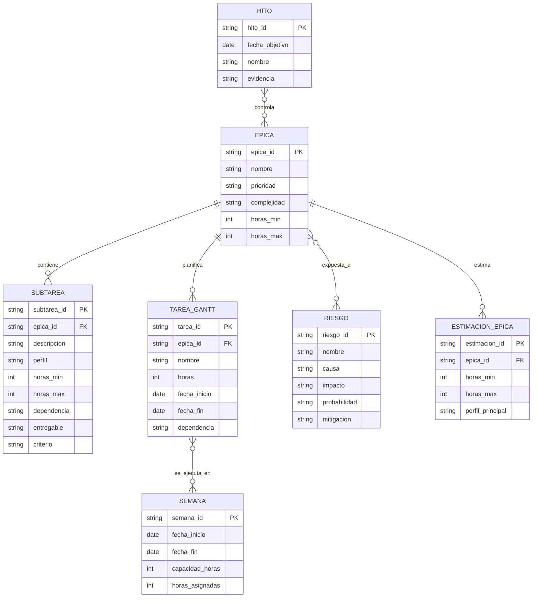

# Reporte funcional y tecnico de actualizacion

Proyecto: `UNED.PersonalAcademico` / Expediente Digital  
Fecha de analisis: 2026-06-02  
Alcance revisado: solucion principal, proyectos `.csproj`, configuraciones, controladores, capas BL/DAL/EL, pruebas unitarias y compilacion local.

## 1. Resumen ejecutivo

El sistema corresponde a una solucion ASP.NET Core empresarial para gestion de expediente digital de personal academico/administrativo. La solucion principal contiene 6 proyectos: MVC web, API REST, BL, DAL, EL y pruebas unitarias. Se identificaron 119 controladores entre frontend MVC y API, modulos de catalogos, expediente, aprobaciones, plazas, reportes, seguridad, integraciones SAUR/AMI/Active Directory, correo, Oracle y generacion documental.

El estado tecnico general es **estable para compilacion**, pero **legacy y de riesgo alto para operacion**: compila con `dotnet build --no-restore` usando SDK 9.0.314, con 0 errores y 114 advertencias. El riesgo mas importante es que todos los proyectos principales apuntan a `netcoreapp2.2`, version fuera de soporte. Microsoft indica que .NET Core 2.2 llego a fin de vida el 2019-12-23 y que las versiones EOL ya no reciben actualizaciones de seguridad. Fuentes: [Microsoft .NET support policy](https://dotnet.microsoft.com/en-us/platform/support/policy/dotnet-core), [descarga .NET Core 2.2](https://dotnet.microsoft.com/en-us/download/dotnet/2.2), [anuncio .NET Blog](https://devblogs.microsoft.com/dotnet/net-core-2-2-will-reach-end-of-life-on-december-23-2019/).

Prioridad general: **critica**. Recomendacion: ejecutar una modernizacion controlada hacia una version LTS vigente, idealmente .NET 8 LTS o la version institucional aprobada, con fase previa de seguridad, rotacion de secretos y pruebas de regresion.

## 2. Diagnostico funcional

| Modulo | Funcion observada | Actualizacion requerida |
|---|---|---|
| Catalogos | Mantenimiento de paises, grados, areas, periodos, tipos, estados, categorias, instituciones | Validar reglas, normalizar CRUD, pruebas funcionales |
| Expediente | Informacion personal, familiar, academica, laboral, idiomas, capacitaciones, documentos, premios, proyectos y produccion academica | Regresion completa por alto impacto usuario |
| Aprobaciones | Aprobacion de capacitaciones, documentos, experiencia, idiomas, proyectos, premios y produccion | Revisar flujos, roles y estados |
| Plazas | Control e historial de plazas, vencimientos y notificaciones | Validar procesos programados y Oracle |
| Seguridad | Login, roles, SAUR, Azure AD, JWT/API, sesion MVC | Reestructurar secretos, autenticacion y autorizacion |
| Reportes/documentos | Reportes, OpenXML, Rotativa/wkhtmltopdf, archivos adjuntos | Validar dependencias, formatos y almacenamiento |
| Integraciones | SAUR, AMI, Active Directory, SMTP, Google Maps, Tribunal Supremo/Gometa | Revisar credenciales, endpoints y resiliencia |

## 3. Diagnostico tecnico

| Aspecto | Hallazgo | Riesgo |
|---|---|---|
| Version .NET | `netcoreapp2.2` en MVC, API, BL, DAL, EL y UnitTests | Critico por fin de soporte |
| Compatibilidad actual | SDK 9 compila, pero advierte `NETSDK1138` | Compilacion no garantiza soporte en runtime |
| NuGet | Advertencias NU1902/NU1903/NU1904 en `Microsoft.AspNetCore.App`, `Microsoft.NETCore.App`, `DotNetZip`, `AutoMapper`, `Oracle.ManagedDataAccess.Core`, `log4net`, `Newtonsoft.Json`, `System.Data.SqlClient` | Vulnerabilidades moderadas, altas y criticas |
| Arquitectura | Separacion por capas MVC/API/BL/DAL/EL, pero BL referencia al proyecto MVC | Acoplamiento no deseado y migracion mas compleja |
| Datos | Oracle por procedimientos almacenados y `Oracle.ManagedDataAccess.Core` | Dependencia fuerte de BD y paquetes vulnerables |
| Seguridad | Secretos visibles en `appsettings.json`: client secret, API keys, passwords, JWT key, SMTP y cadena Oracle | Critico: rotacion inmediata |
| Autenticacion | Uso de sesion, `UseAuthentication`, JWT/API y SAUR/AD | Requiere revision integral de roles, claims y expiracion |
| Despliegue | Hay `pubxml`, ASP.NET Core Web y rutas IIS/logs Windows | Falta confirmacion de ambiente productivo exacto |
| Calidad | 114 advertencias, metodos async sin await, APIs obsoletas, conflictos de ensamblados | Deuda tecnica media/alta |
| Pruebas | UnitTests con pocos archivos frente al tamano funcional | Cobertura insuficiente para migracion |

## 4. Que se debe actualizar y por que

| Elemento | Estado actual | Problema | Riesgo de no actualizar | Beneficio | Prioridad | Complejidad |
|---|---|---|---|---|---|---|
| Framework .NET | .NET Core 2.2 | EOL desde 2019-12-23 | Exposicion a vulnerabilidades y obsolescencia | Soporte, seguridad, rendimiento | Alta | Alta |
| Paquetes NuGet | Versiones antiguas con NU190x | Vulnerabilidades conocidas | Incidentes de seguridad | Reduccion de superficie de ataque | Alta | Alta |
| Secretos | En archivos de configuracion | Exposicion directa | Compromiso de sistemas externos | Gestion segura y auditoria | Alta | Media |
| Autenticacion/autorizacion | Mixta: sesion, Azure AD, SAUR, JWT | Riesgo de inconsistencias | Accesos indebidos | Modelo de seguridad gobernable | Alta | Alta |
| DAL Oracle | Procedimientos y helper propio | Paquete vulnerable y acoplamiento | Fallos de compatibilidad | Acceso a datos actualizado | Alta | Media |
| Arquitectura | BL referencia MVC | Acoplamiento circular funcional | Migracion lenta y pruebas fragiles | Separacion limpia de responsabilidades | Media | Alta |
| Pruebas | Cobertura baja | Regresion no detectable | Fallos en produccion | Confianza para modernizar | Alta | Media |
| Despliegue | `pubxml`, rutas Windows/logs | Configuracion no gobernada | Fallos por ambiente | Publicacion repetible | Media | Media |
| Codigo async/obsoleto | 114 advertencias | Deuda tecnica | Rendimiento y mantenibilidad | Codigo mas claro y robusto | Media | Media |
| Documentacion | Evidencia parcial | Conocimiento tacito | Dependencia de personas | Transferencia y soporte | Media | Baja |

## 5. Estimacion de horas hombre sin IA

| Tarea | Perfil | Min | Max | Justificacion |
|---|---:|---:|---:|---|
| Analisis inicial y levantamiento | Arquitecto / Analista | 40 | 64 | Inventario tecnico-funcional y alcance |
| Revision de codigo y dependencias | Senior | 56 | 96 | 6 proyectos principales, 119 controladores |
| Documentacion funcional | Analista funcional | 48 | 80 | Modulos de expediente, catalogos, plazas y aprobaciones |
| Documentacion tecnica | Arquitecto / Senior | 40 | 72 | Arquitectura, integraciones, despliegue |
| Refactorizacion arquitectura | Senior / Arquitecto | 96 | 180 | Separacion BL/MVC, acoplamientos y patrones |
| Actualizacion .NET/NuGet | Senior | 120 | 220 | Migracion 2.2 a LTS vigente y compatibilidad |
| Seguridad y secretos | Senior / DevOps | 80 | 140 | Rotacion, vault, JWT, AD, SAUR, SMTP |
| Acceso a datos Oracle | Senior / DBA | 60 | 120 | Paquetes, procedimientos, pruebas con BD |
| Pruebas unitarias | Developer / QA | 80 | 150 | Cobertura minima de servicios/controladores criticos |
| Pruebas funcionales | QA / Analista | 80 | 140 | Flujos principales y regresion |
| Correccion de errores | Senior / Intermedio | 70 | 140 | Defectos posteriores a migracion |
| Validacion usuarios | Analista / QA | 32 | 64 | UAT y ajustes menores |
| Publicacion pruebas | DevOps | 24 | 48 | Ambiente QA/UAT |
| Publicacion produccion | DevOps / Senior | 24 | 48 | Paso a produccion y monitoreo inicial |
| Documentacion final | Analista / Senior | 24 | 40 | Cierre, manuales y bitacora |

Total estimado: **876 a 1.542 horas hombre**.

## 6. Primer reporte: tareas epicas

| Codigo | Epica | Descripcion funcional | Justificacion | Prioridad | Complejidad | Perfil | Min | Max | Riesgo si no se realiza | Resultado |
|---|---|---|---|---|---|---|---:|---:|---|---|
| EP-01 | Analisis funcional y tecnico | Inventario completo del sistema | Base de plan realista | P1 | Media | Arquitecto/Analista | 40 | 64 | Alcance incompleto | Diagnostico aprobado |
| EP-02 | Actualizacion .NET y NuGet | Migrar framework y paquetes | 2.2 EOL y vulnerabilidades | P1 | Alta | Senior | 120 | 220 | Riesgo de seguridad | Solucion moderna compilable |
| EP-03 | Seguridad y autenticacion | Secretos, roles, JWT, AD, SAUR | Secretos visibles | P1 | Alta | Senior/DevOps | 80 | 140 | Compromiso de credenciales | Seguridad saneada |
| EP-04 | Arquitectura y capas | Reducir acoplamientos | BL referencia MVC | P2 | Alta | Arquitecto | 96 | 180 | Migracion fragil | Capas limpias |
| EP-05 | Correccion tecnica | Async, obsoletos, conflictos | 114 advertencias | P2 | Media | Senior | 70 | 140 | Deuda acumulada | Build con menos advertencias |
| EP-06 | Acceso a datos | Oracle/procedimientos | Paquetes vulnerables | P2 | Media | Senior/DBA | 60 | 120 | Fallos datos | DAL validado |
| EP-07 | Pruebas | Unitarias y funcionales | Cobertura baja | P1 | Media | QA/Dev | 160 | 290 | Regresion no detectada | Suite minima y UAT |
| EP-08 | Documentacion | Funcional, tecnica, operativa | Conocimiento tacito | P3 | Baja | Analista/Senior | 64 | 112 | Soporte dificil | Documentos formales |
| EP-09 | Preparacion despliegue | QA, produccion, configuracion | Despliegue no evidenciado completo | P2 | Media | DevOps | 48 | 96 | Paso a produccion riesgoso | Pipeline/procedimiento |
| EP-10 | Validacion final | Usuarios y cierre | Confirmar operacion | P2 | Media | Analista/QA | 32 | 64 | Rechazo usuario | Acta de aceptacion |

## 7. Segundo reporte: epicas con subtareas

| Epica | Subtarea | Descripcion | Motivo | Perfil | Min | Max | Dependencia | Entregable | Criterio |
|---|---|---|---|---|---:|---:|---|---|---|
| EP-01 | ST-01 | Inventariar proyectos, modulos y dependencias | Alcance | Arquitecto | 16 | 24 | Codigo | Inventario | Validado por lider |
| EP-01 | ST-02 | Levantar flujos funcionales | Mapa funcional | Analista | 24 | 40 | Usuarios clave | Matriz funcional | Cobertura de modulos |
| EP-02 | ST-01 | Evaluar ruta .NET 2.2 a LTS | Modernizacion | Senior | 24 | 40 | EP-01 | Plan migracion | Ruta aprobada |
| EP-02 | ST-02 | Actualizar paquetes vulnerables | Seguridad | Senior | 40 | 80 | ST-01 | Paquetes actualizados | Build exitoso |
| EP-02 | ST-03 | Corregir errores de compatibilidad | Compilacion | Senior | 56 | 100 | ST-02 | Solucion compilable | 0 errores |
| EP-03 | ST-01 | Retirar secretos de appsettings | Exposicion | DevOps | 24 | 40 | Accesos | Config segura | Sin secretos en repo |
| EP-03 | ST-02 | Rotar credenciales expuestas | Contencion | DevOps/Senior | 24 | 48 | Dueños sistemas | Credenciales nuevas | Validado por sistemas |
| EP-03 | ST-03 | Revisar roles/JWT/AD/SAUR | Acceso | Senior | 32 | 52 | ST-01 | Matriz seguridad | Pruebas acceso |
| EP-04 | ST-01 | Eliminar dependencia BL -> MVC | Acoplamiento | Arquitecto | 40 | 80 | EP-02 | BL desacoplada | Sin referencia MVC |
| EP-04 | ST-02 | Normalizar servicios y DI | Mantenibilidad | Senior | 32 | 60 | ST-01 | DI revisada | Pruebas pasan |
| EP-04 | ST-03 | Revisar manejo de errores | Robustez | Senior | 24 | 40 | ST-02 | Middleware/documento | Errores controlados |
| EP-05 | ST-01 | Corregir async sin await | Calidad | Intermedio | 24 | 48 | Build | Warnings reducidos | Revision tecnica |
| EP-05 | ST-02 | Reemplazar APIs obsoletas | Mantenibilidad | Senior | 32 | 64 | EP-04 | Codigo actualizado | Sin obsoletos criticos |
| EP-05 | ST-03 | Resolver conflictos ensamblados | Compatibilidad | Senior | 14 | 28 | EP-02 | Dependencias alineadas | Sin MSB3277 |
| EP-06 | ST-01 | Validar Oracle y procedimientos | Datos | DBA/Senior | 24 | 48 | BD pruebas | Matriz SP | Ejecucion controlada |
| EP-06 | ST-02 | Actualizar proveedor Oracle | Seguridad | Senior | 20 | 40 | EP-02 | Driver actualizado | Conexion OK |
| EP-06 | ST-03 | Pruebas CRUD principales | Regresion | QA/DBA | 16 | 32 | ST-01 | Evidencia pruebas | Casos aprobados |
| EP-07 | ST-01 | Definir estrategia de pruebas | Cobertura | QA | 16 | 24 | EP-01 | Plan QA | Aprobado |
| EP-07 | ST-02 | Crear pruebas unitarias criticas | Regresion | Dev/QA | 60 | 120 | EP-04 | Suite pruebas | Cobertura minima |
| EP-07 | ST-03 | Ejecutar pruebas funcionales | UAT | QA/Analista | 80 | 146 | Ambiente QA | Evidencia | Casos cerrados |
| EP-08 | ST-01 | Documentar arquitectura | Transferencia | Arquitecto | 24 | 40 | EP-04 | Documento tecnico | Revisado |
| EP-08 | ST-02 | Documentar procesos funcionales | Soporte | Analista | 40 | 72 | Usuarios | Manual funcional | Aprobado |
| EP-09 | ST-01 | Preparar ambiente QA | Despliegue | DevOps | 24 | 48 | Config segura | Ambiente listo | Smoke test OK |
| EP-09 | ST-02 | Preparar paso a produccion | Operacion | DevOps/Senior | 24 | 48 | UAT | Plan despliegue | Rollback definido |
| EP-10 | ST-01 | Validacion usuarios | Aceptacion | Analista/QA | 24 | 48 | EP-07 | Acta UAT | Firmada |
| EP-10 | ST-02 | Cierre y lecciones aprendidas | Gobierno | Analista | 8 | 16 | ST-01 | Informe cierre | Aprobado |

Total subtareas detalladas: **26**.

## 8. Matriz de priorizacion

| Epica | Impacto funcional | Impacto tecnico | Riesgo operativo | Esfuerzo | Urgencia | Prioridad |
|---|---|---|---|---|---|---|
| EP-02 | Alto | Alto | Alto | Alto | Alta | P1 critica |
| EP-03 | Alto | Alto | Alto | Medio | Alta | P1 critica |
| EP-07 | Alto | Medio | Alto | Alto | Alta | P1 critica |
| EP-04 | Medio | Alto | Medio | Alto | Media | P2 importante |
| EP-05 | Medio | Medio | Medio | Medio | Media | P2 importante |
| EP-06 | Alto | Medio | Alto | Medio | Media | P2 importante |
| EP-09 | Medio | Medio | Alto | Medio | Media | P2 importante |
| EP-10 | Alto | Bajo | Medio | Bajo | Media | P2 importante |
| EP-01 | Medio | Medio | Medio | Bajo | Alta | P2 importante |
| EP-08 | Medio | Bajo | Bajo | Bajo | Baja | P3 recomendable |

### Costo estimado en horas de tareas criticas

La siguiente tabla separa las epicas clasificadas como **P1 critica**, indicando el costo estimado en horas hombre para su ejecucion manual, sin intervencion de inteligencia artificial.

| Epica | Nombre de la epica | Impacto funcional | Impacto tecnico | Riesgo operativo | Esfuerzo | Urgencia | Prioridad | Horas minimas | Horas maximas | Perfil principal |
|---|---|---|---|---|---|---|---|---:|---:|---|
| EP-02 | Actualizacion .NET y NuGet | Alto | Alto | Alto | Alto | Alta | P1 critica | 120 | 220 | Desarrollador senior .NET |
| EP-03 | Seguridad y autenticacion | Alto | Alto | Alto | Medio | Alta | P1 critica | 80 | 140 | Desarrollador senior / DevOps |
| EP-07 | Pruebas | Alto | Medio | Alto | Alto | Alta | P1 critica | 160 | 290 | QA / Desarrollador .NET |

| Indicador | Horas |
|---|---:|
| Total minimo tareas criticas | 360 |
| Total maximo tareas criticas | 650 |

### Detalle operativo para historias de usuario y sprints

La siguiente tabla descompone las epicas criticas en tareas base para iniciar la creacion de historias de usuario, criterios de aceptacion y planificacion de sprints. La propuesta asume sprints de 2 semanas y debe ajustarse segun disponibilidad real del equipo, acceso a ambientes, dependencias institucionales y prioridad definida por la jefatura del proyecto.

| Epica | Sprint sugerido | Tarea base para historia de usuario | Enfoque de historia de usuario | Perfil responsable | Horas minimas | Horas maximas | Dependencias | Entregable esperado | Criterio base de aceptacion |
|---|---|---|---|---|---:|---:|---|---|---|
| EP-03 | Sprint 1 | Inventariar secretos y configuraciones sensibles | Como equipo tecnico, necesito identificar secretos expuestos para definir acciones de mitigacion. | DevOps / Senior .NET | 8 | 16 | Acceso al codigo y configuraciones | Matriz de secretos y configuraciones sensibles | Existe inventario validado sin publicar valores secretos |
| EP-03 | Sprint 1 | Retirar secretos de `appsettings.json` | Como administrador tecnico, necesito mover secretos fuera del codigo fuente para reducir riesgo de exposicion. | DevOps | 16 | 24 | Matriz de secretos | Configuracion basada en variables de entorno o gestor seguro | El repositorio no contiene secretos activos |
| EP-03 | Sprint 1 | Rotar credenciales expuestas | Como responsable de seguridad, necesito reemplazar credenciales expuestas para invalidar accesos comprometidos. | DevOps / Sistemas externos | 24 | 48 | Coordinacion con responsables de Oracle, SMTP, SAUR, AMI, AD y APIs | Credenciales rotadas y documentadas en canal seguro | Las credenciales anteriores no son funcionales y las nuevas operan correctamente |
| EP-03 | Sprint 2 | Revisar autenticacion y autorizacion | Como usuario autorizado, necesito que el sistema valide correctamente roles y permisos para proteger funciones sensibles. | Senior .NET / Analista | 20 | 32 | Credenciales saneadas | Matriz de roles, permisos y flujos de acceso | Los roles criticos tienen reglas documentadas y probadas |
| EP-03 | Sprint 2 | Validar JWT, sesion y expiracion | Como responsable tecnico, necesito verificar tiempos de sesion y tokens para evitar accesos indebidos. | Senior .NET | 12 | 20 | Configuracion segura | Configuracion de seguridad validada | Token y sesion expiran segun politica definida |
| EP-02 | Sprint 2 | Definir ruta de migracion .NET | Como arquitecto, necesito definir la version objetivo y estrategia de migracion para reducir riesgo tecnico. | Arquitecto .NET | 16 | 24 | Inventario tecnico | Documento de ruta de migracion | Version objetivo y fases aprobadas |
| EP-02 | Sprint 2 | Actualizar paquetes NuGet vulnerables en rama controlada | Como desarrollador, necesito actualizar dependencias vulnerables para reducir riesgos de seguridad. | Senior .NET | 24 | 48 | Ruta de migracion | Rama tecnica con paquetes actualizados | La solucion compila o registra errores controlados de compatibilidad |
| EP-02 | Sprint 3 | Migrar proyectos principales a version .NET objetivo | Como equipo tecnico, necesito migrar MVC, API, BL, DAL, EL y pruebas a una version soportada. | Senior .NET / Arquitecto | 40 | 80 | Paquetes revisados | Proyectos migrados | Los proyectos restauran paquetes y compilan en ambiente controlado |
| EP-02 | Sprint 3 | Corregir errores de compilacion por migracion | Como desarrollador, necesito resolver incompatibilidades para obtener una solucion funcional. | Senior .NET | 32 | 60 | Migracion inicial | Solucion compilable | `dotnet build` finaliza con 0 errores |
| EP-02 | Sprint 4 | Validar compatibilidad de MVC, API y middleware | Como equipo tecnico, necesito confirmar que rutas, filtros, Swagger, sesiones y middleware funcionan tras la migracion. | Senior .NET / QA | 24 | 40 | Build migrado | Evidencia tecnica de compatibilidad | MVC y API responden en ambiente de pruebas |
| EP-02 | Sprint 4 | Actualizar documentacion tecnica de dependencias | Como mantenedor, necesito documentar cambios de framework y paquetes para soporte futuro. | Senior .NET | 8 | 16 | Migracion validada | Documento tecnico actualizado | Dependencias y cambios quedan trazables |
| EP-07 | Sprint 1 | Definir plan de pruebas criticas | Como QA, necesito identificar escenarios prioritarios para validar la modernizacion. | QA / Analista funcional | 16 | 24 | Inventario funcional | Plan de pruebas criticas | Plan aprobado por lider tecnico y funcional |
| EP-07 | Sprint 2 | Diseñar casos de prueba para seguridad y login | Como QA, necesito validar accesos, roles y sesiones para evitar regresiones de seguridad. | QA / Analista | 16 | 28 | Matriz de roles | Casos de prueba de seguridad | Casos cubren login, roles, token y expiracion |
| EP-07 | Sprint 3 | Diseñar casos de prueba para expediente y catalogos | Como usuario funcional, necesito confirmar que los procesos principales siguen operando correctamente. | QA / Analista | 24 | 40 | Mapa funcional | Casos de prueba funcionales | Casos cubren expediente, catalogos, documentos y aprobaciones |
| EP-07 | Sprint 3 | Crear pruebas unitarias iniciales para servicios criticos | Como desarrollador, necesito automatizar pruebas basicas para detectar regresiones tempranas. | Developer .NET / QA tecnico | 40 | 80 | Servicios estabilizados | Suite inicial de pruebas unitarias | Las pruebas se ejecutan en pipeline o comando local |
| EP-07 | Sprint 4 | Ejecutar regresion funcional completa | Como equipo de proyecto, necesito verificar que los flujos criticos funcionan despues de la migracion. | QA / Analista funcional | 48 | 90 | Ambiente QA migrado | Evidencia de pruebas ejecutadas | Defectos criticos registrados y priorizados |
| EP-07 | Sprint 5 | Corregir defectos detectados en pruebas | Como desarrollador, necesito corregir defectos para estabilizar la version candidata. | Senior .NET / Intermedio | 40 | 80 | Resultado de regresion | Defectos corregidos | Defectos criticos cerrados o con plan aceptado |
| EP-07 | Sprint 5 | Validacion final con usuarios clave | Como usuario clave, necesito validar los procesos modernizados antes de produccion. | Analista funcional / QA | 16 | 32 | Defectos criticos corregidos | Acta o evidencia UAT | Usuarios clave aprueban o documentan observaciones |

| Indicador de planificacion critica | Valor estimado |
|---|---:|
| Total tareas base para historias | 18 |
| Sprints sugeridos | 5 |
| Horas minimas plan operativo critico | 424 |
| Horas maximas plan operativo critico | 802 |

Nota: este detalle operativo puede superar el rango resumido de 360 a 650 horas porque incluye actividades preparatorias para historias de usuario, documentacion de aceptacion, validacion por sprint y estabilizacion. Para planificacion contractual se recomienda usar el rango ampliado cuando el equipo no cuente con pruebas automatizadas ni ambientes totalmente preparados.

## 9. Riesgos del proyecto

| Riesgo | Causa probable | Impacto | Probabilidad | Mitigacion |
|---|---|---|---|---|
| Framework sin soporte | `netcoreapp2.2` | Alto | Alta | Migrar a LTS |
| Secretos expuestos | Credenciales en JSON | Critico | Alta | Rotar y mover a vault/variables |
| Vulnerabilidades NuGet | Paquetes antiguos | Alto | Alta | Actualizar y auditar |
| Regresion funcional | Baja cobertura pruebas | Alto | Alta | Plan QA y pruebas automatizadas |
| Fallos en Oracle | Procedimientos y driver antiguo | Alto | Media | Ambiente BD de pruebas y DBA |
| Acoplamiento entre capas | Referencia BL -> MVC | Medio | Media | Refactor gradual |
| Despliegue no repetible | Configuracion manual/pubxml | Medio | Media | Pipeline o runbook |
| Integraciones externas inestables | SAUR/AMI/AD/SMTP/API externas | Alto | Media | Pruebas de contrato y monitoreo |

## 10. Supuestos de estimacion

La solucion compila actualmente con 0 errores y 114 advertencias. Existe acceso al codigo fuente completo. Se asume acceso a base de datos Oracle de pruebas, ambiente QA, credenciales institucionales para rotacion, usuarios clave para validacion y permiso para actualizar paquetes internos UNED. No se incluyen cambios funcionales nuevos ni rediseño visual completo. No se incluyen tiempos administrativos externos ni ventanas de aprobacion institucional.

Informacion faltante que afecta la estimacion: version real de IIS/runtime productivo, arquitectura de servidores, pipeline actual, cobertura real de pruebas manuales, inventario de procedimientos Oracle, criticidad de cada modulo, SLA productivo y politica institucional de version .NET objetivo.

## 11. Resultado final

| Indicador | Resultado |
|---|---|
| Total de epicas | 10 |
| Total de subtareas detalladas | 26 |
| Total minimo estimado | 876 horas |
| Total maximo estimado | 1.542 horas |
| Perfil mas requerido | Desarrollador senior .NET / Arquitecto .NET |
| Nivel general de riesgo | Alto / Critico por seguridad y EOL (End of Life)|
| Recomendacion final | Modernizacion controlada, iniciando por seguridad y framework |
| Orden recomendado | EP-01, EP-03, EP-02, EP-04, EP-06, EP-05, EP-07, EP-09, EP-10, EP-08 |

## Evidencia tecnica local usada

- `UNED.PersonalAcademico.sln`: 6 proyectos principales.
- `UNED.PersonalAcademico.csproj`, `UNED.PersonalAcademico.API.csproj`, `UNED.PersonalAcademico.BL.csproj`, `UNED.PersonalAcademico.DAL.csproj`, `UNED.PersonalAcademico.EL.csproj`, `UNED.PersonalAcademico.UnitTests.csproj`: `TargetFramework netcoreapp2.2`.
- `UNED.PersonalAcademico/appsettings.json` y `UNED.PersonalAcademico.API/appsettings.json`: configuraciones con secretos y endpoints.
- `dotnet build UNED.PersonalAcademico.sln --no-restore`: 0 errores, 114 advertencias.

## 12. Cronograma tipo Gantt para EP-03, EP-02 y EP-07

Este cronograma se ajusta a la jornada indicada por el programador: **6 horas funcionales por dia, 5 dias por semana**, para una capacidad semanal de **30 horas**. La planificacion se calcula como trabajo principalmente ejecutado por una persona programadora, con apoyo puntual de DevOps, QA, DBA y responsables de integraciones cuando sea necesario.

Periodo propuesto: lunes 2026-06-08 al viernes 2026-11-13.  
Duracion total: 23 semanas.  
Capacidad semanal: 30 horas.  
Capacidad total disponible: 690 horas.  
Esfuerzo planificado: **673 horas**.  
Reserva tecnica aproximada: **17 horas**.

### Resumen de esfuerzo por epica

| Epica | Nombre | Horas planificadas | Semanas principales | Resultado esperado |
|---|---|---:|---|---|
| EP-03 | Seguridad y autenticacion | 124 | S1 a S7 | Secretos saneados, credenciales rotadas y reglas de acceso revisadas. |
| EP-02 | Actualizacion .NET y NuGet | 268 | S6 a S14 | Solucion migrada, paquetes actualizados, build estable y dependencias documentadas. |
| EP-07 | Pruebas unitarias y funcionales | 281 | S1 a S23 | Plan QA, casos, pruebas unitarias, regresion, defectos corregidos y UAT. |
| **Total** | **EP-03, EP-02 y EP-07** | **673** | **23 semanas** | **Version candidata validada tecnicamente.** |

### Semanas del cronograma

| Semana | Fechas | Capacidad |
|---|---|---:|
| S1 | 2026-06-08 al 2026-06-12 | 30 h |
| S2 | 2026-06-15 al 2026-06-19 | 30 h |
| S3 | 2026-06-22 al 2026-06-26 | 30 h |
| S4 | 2026-06-29 al 2026-07-03 | 30 h |
| S5 | 2026-07-06 al 2026-07-10 | 30 h |
| S6 | 2026-07-13 al 2026-07-17 | 30 h |
| S7 | 2026-07-20 al 2026-07-24 | 30 h |
| S8 | 2026-07-27 al 2026-07-31 | 30 h |
| S9 | 2026-08-03 al 2026-08-07 | 30 h |
| S10 | 2026-08-10 al 2026-08-14 | 30 h |
| S11 | 2026-08-17 al 2026-08-21 | 30 h |
| S12 | 2026-08-24 al 2026-08-28 | 30 h |
| S13 | 2026-08-31 al 2026-09-04 | 30 h |
| S14 | 2026-09-07 al 2026-09-11 | 30 h |
| S15 | 2026-09-14 al 2026-09-18 | 30 h |
| S16 | 2026-09-21 al 2026-09-25 | 30 h |
| S17 | 2026-09-28 al 2026-10-02 | 30 h |
| S18 | 2026-10-05 al 2026-10-09 | 30 h |
| S19 | 2026-10-12 al 2026-10-16 | 30 h |
| S20 | 2026-10-19 al 2026-10-23 | 30 h |
| S21 | 2026-10-26 al 2026-10-30 | 30 h |
| S22 | 2026-11-02 al 2026-11-06 | 30 h |
| S23 | 2026-11-09 al 2026-11-13 | 30 h |

### Cronograma tipo Gantt por tarea

Leyenda: `X` = semana con trabajo planificado.

| ID | Epica | Tarea | Horas | Inicio | Fin | Dependencia | S1 | S2 | S3 | S4 | S5 | S6 | S7 | S8 | S9 | S10 | S11 | S12 | S13 | S14 | S15 | S16 | S17 | S18 | S19 | S20 | S21 | S22 | S23 |
|---|---|---|---:|---|---|---|---|---|---|---|---|---|---|---|---|---|---|---|---|---|---|---|---|---|---|---|---|---|---|
| T01 | EP-03 | Inventariar secretos, endpoints y configuraciones sensibles | 12 | 2026-06-08 | 2026-06-12 | Codigo fuente | X |  |  |  |  |  |  |  |  |  |  |  |  |  |  |  |  |  |  |  |  |  |  |
| T02 | EP-07 | Definir plan de pruebas criticas | 20 | 2026-06-08 | 2026-06-19 | Inventario | X | X |  |  |  |  |  |  |  |  |  |  |  |  |  |  |  |  |  |  |  |  |  |
| T03 | EP-03 | Clasificar riesgos de seguridad | 10 | 2026-06-15 | 2026-06-19 | T01 |  | X |  |  |  |  |  |  |  |  |  |  |  |  |  |  |  |  |  |  |  |  |  |
| T04 | EP-03 | Retirar secretos de appsettings.json | 20 | 2026-06-15 | 2026-06-26 | T01 |  | X | X |  |  |  |  |  |  |  |  |  |  |  |  |  |  |  |  |  |  |  |  |
| T05 | EP-03 | Rotacion de credenciales expuestas | 36 | 2026-06-22 | 2026-07-10 | T01, externos |  |  | X | X | X |  |  |  |  |  |  |  |  |  |  |  |  |  |  |  |  |  |  |
| T06 | EP-03 | Revisar roles, permisos, JWT, AD, SAUR | 26 | 2026-06-29 | 2026-07-17 | T04 |  |  |  | X | X | X |  |  |  |  |  |  |  |  |  |  |  |  |  |  |  |  |  |
| T07 | EP-07 | Casos de prueba login, roles, JWT | 22 | 2026-07-06 | 2026-07-17 | T06 |  |  |  |  | X | X |  |  |  |  |  |  |  |  |  |  |  |  |  |  |  |  |  |
| T08 | EP-03 | Pruebas tecnicas de seguridad | 16 | 2026-07-13 | 2026-07-24 | T06, T07 |  |  |  |  |  | X | X |  |  |  |  |  |  |  |  |  |  |  |  |  |  |  |  |
| T09 | EP-02 | Definir ruta migracion .NET | 20 | 2026-07-13 | 2026-07-24 | Diagnostico |  |  |  |  |  | X | X |  |  |  |  |  |  |  |  |  |  |  |  |  |  |  |  |
| T10 | EP-02 | Actualizar paquetes NuGet vulnerables | 36 | 2026-07-20 | 2026-08-07 | T09 |  |  |  |  |  |  | X | X | X |  |  |  |  |  |  |  |  |  |  |  |  |  |  |
| T11 | EP-02 | Migrar proyectos MVC, API, BL, DAL, EL | 60 | 2026-08-03 | 2026-08-21 | T09, T10 |  |  |  |  |  |  |  |  | X | X | X |  |  |  |  |  |  |  |  |  |  |  |  |
| T12 | EP-02 | Corregir errores de compilacion | 46 | 2026-08-17 | 2026-09-04 | T11 |  |  |  |  |  |  |  |  |  |  | X | X | X |  |  |  |  |  |  |  |  |  |  |
| T13 | EP-02 | Validar middleware, rutas, API, Swagger | 32 | 2026-08-24 | 2026-09-11 | T12 |  |  |  |  |  |  |  |  |  |  |  | X | X | X |  |  |  |  |  |  |  |  |  |
| T14 | EP-02 | Validar Oracle e integraciones | 24 | 2026-08-31 | 2026-09-11 | T12 |  |  |  |  |  |  |  |  |  |  |  |  | X | X |  |  |  |  |  |  |  |  |  |
| T15 | EP-02 | Documentacion tecnica framework | 12 | 2026-09-07 | 2026-09-18 | T13, T14 |  |  |  |  |  |  |  |  |  |  |  |  |  | X | X |  |  |  |  |  |  |  |  |
| T16 | EP-07 | Casos expediente, catalogos, aprobaciones | 32 | 2026-09-07 | 2026-09-25 | T02 |  |  |  |  |  |  |  |  |  |  |  |  |  | X | X | X |  |  |  |  |  |  |  |
| T17 | EP-07 | Pruebas unitarias servicios criticos | 60 | 2026-09-21 | 2026-10-16 | T10, T11 |  |  |  |  |  |  |  |  |  |  |  |  |  |  |  | X | X | X | X |  |  |  |  |
| T18 | EP-07 | Datos de prueba y checklist | 23 | 2026-10-05 | 2026-10-16 | T16 |  |  |  |  |  |  |  |  |  |  |  |  |  |  |  |  |  | X | X |  |  |  |  |
| T19 | EP-07 | Regresion funcional completa en QA | 69 | 2026-10-12 | 2026-10-30 | T13, T18 |  |  |  |  |  |  |  |  |  |  |  |  |  |  |  |  |  |  | X | X | X |  |  |
| T20 | EP-07 | Corregir defectos detectados | 60 | 2026-10-26 | 2026-11-13 | T19 |  |  |  |  |  |  |  |  |  |  |  |  |  |  |  |  |  |  |  |  | X | X | X |
| T21 | EP-07 | Reejecutar pruebas y evidencia UAT | 24 | 2026-11-02 | 2026-11-13 | T20 |  |  |  |  |  |  |  |  |  |  |  |  |  |  |  |  |  |  |  |  |  | X | X |
| T22 | EP-07 | Validacion final con usuarios clave | 13 | 2026-11-09 | 2026-11-13 | T21 |  |  |  |  |  |  |  |  |  |  |  |  |  |  |  |  |  |  |  |  |  |  | X |

### Carga semanal ajustada a 6 horas funcionales diarias

| Semana | Fechas | Horas asignadas | Capacidad semanal | Diferencia | Enfoque | Descripción para seguimiento gerencial |
|---|---|---:|---:|---:|---|---|
| S1 | 2026-06-08 al 2026-06-12 | 30,0 | 30 | 0,0 | Inventario de seguridad y plan QA | Se revisa el código para identificar contraseñas y datos sensibles que están expuestos, y se prepara el plan de pruebas inicial |
| S2 | 2026-06-15 al 2026-06-19 | 30,0 | 30 | 0,0 | Secretos y rotacion inicial | Se retiran las contraseñas visibles del código y se inicia la coordinación con otras áreas para cambiar credenciales comprometidas |
| S3 | 2026-06-22 al 2026-06-26 | 30,0 | 30 | 0,0 | Secretos y rotacion continuacion | Se continúa cambiando las contraseñas de base de datos, correo y conexiones externas en coordinación con administradores |
| S4 | 2026-06-29 al 2026-07-03 | 30,0 | 30 | 0,0 | Roles, permisos y casos de seguridad | Se revisa quién puede acceder a qué funciones del sistema y se diseñan pruebas para validar que los permisos funcionen correctamente |
| S5 | 2026-07-06 al 2026-07-10 | 30,0 | 30 | 0,0 | Pruebas de seguridad y casos QA | Se ejecutan pruebas para confirmar que los cambios de seguridad no afectan el acceso de usuarios autorizados y se documentan más casos de prueba |
| S6 | 2026-07-13 al 2026-07-17 | 30,0 | 30 | 0,0 | Seguridad tecnica y ruta .NET | Se finalizan ajustes de seguridad y se define el plan técnico para actualizar la plataforma de programación del sistema |
| S7 | 2026-07-20 al 2026-07-24 | 30,0 | 30 | 0,0 | Ruta .NET y paquetes NuGet | Se establece la estrategia de actualización tecnológica y se revisan las bibliotecas de software que tienen vulnerabilidades conocidas |
| S8 | 2026-07-27 al 2026-07-31 | 30,0 | 30 | 0,0 | Paquetes NuGet actualizacion | Se actualizan las bibliotecas de software a versiones más seguras y modernas, verificando que el sistema compile correctamente |
| S9 | 2026-08-03 al 2026-08-07 | 30,0 | 30 | 0,0 | Migracion de proyectos inicio | Se inicia el cambio de los 6 proyectos principales del sistema a la nueva versión de la plataforma de desarrollo |
| S10 | 2026-08-10 al 2026-08-14 | 30,0 | 30 | 0,0 | Migracion de proyectos continuacion | Se completa la migración de todos los proyectos y se realizan las primeras compilaciones para detectar incompatibilidades |
| S11 | 2026-08-17 al 2026-08-21 | 30,0 | 30 | 0,0 | Errores de compilacion | Se corrigen los errores técnicos que aparecen al compilar el sistema con la nueva versión de la plataforma |
| S12 | 2026-08-24 al 2026-08-28 | 30,0 | 30 | 0,0 | Compatibilidad y build | Se verifica que todas las partes del sistema funcionen juntas y se logra una compilación completa y estable |
| S13 | 2026-08-31 al 2026-09-04 | 30,0 | 30 | 0,0 | Middleware y validaciones | Se prueba que las rutas web, la API de servicios y las configuraciones de sesión funcionen correctamente después de la actualización |
| S14 | 2026-09-07 al 2026-09-11 | 30,0 | 30 | 0,0 | Oracle, integraciones y documentacion | Se valida la conexión a la base de datos Oracle y las integraciones con sistemas externos, y se actualiza la documentación técnica |
| S15 | 2026-09-14 al 2026-09-18 | 30,0 | 30 | 0,0 | Casos de prueba funcionales | Se preparan los escenarios de prueba detallados para validar expedientes, catálogos, documentos y procesos de aprobación |
| S16 | 2026-09-21 al 2026-09-25 | 30,0 | 30 | 0,0 | Pruebas unitarias inicio | Se crean pruebas automáticas para las funciones más críticas del sistema, que permiten detectar errores rápidamente |
| S17 | 2026-09-28 al 2026-10-02 | 30,0 | 30 | 0,0 | Pruebas unitarias continuacion | Se completa la suite de pruebas automáticas alcanzando una cobertura mínima aceptable de los servicios principales |
| S18 | 2026-10-05 al 2026-10-09 | 30,0 | 30 | 0,0 | Datos de prueba y regresion | Se prepara información de prueba realista y se inicia la ejecución completa de todos los casos de prueba funcionales |
| S19 | 2026-10-12 al 2026-10-16 | 30,0 | 30 | 0,0 | Regresion funcional | Se ejecuta el plan completo de pruebas funcionales en ambiente de calidad, validando expediente, catálogos y reportes |
| S20 | 2026-10-19 al 2026-10-23 | 30,0 | 30 | 0,0 | Regresion funcional continuacion | Se completan las pruebas funcionales restantes, incluyendo aprobaciones, plazas e integraciones con sistemas externos |
| S21 | 2026-10-26 al 2026-10-30 | 30,0 | 30 | 0,0 | Correccion de defectos | Se analizan y corrigen los errores funcionales detectados durante las pruebas, priorizando los de mayor impacto |
| S22 | 2026-11-02 al 2026-11-06 | 30,0 | 30 | 0,0 | Correccion de defectos y reejecucion | Se completan las correcciones de errores críticos y se vuelven a ejecutar las pruebas afectadas para confirmar las soluciones |
| S23 | 2026-11-09 al 2026-11-13 | 13,0 | 30 | 17,0 | Evidencia UAT, validacion final y reserva | Usuarios clave validan el sistema actualizado, se recopila evidencia de aceptación y se cierra formalmente el proyecto técnico |
| **Total** | **Periodo completo** | **673,0** | **690,0** | **17,0** | **EP-03, EP-02 y EP-07** | **Modernización completa del sistema con seguridad saneada, plataforma actualizada y funcionalidad validada** |

### Hitos de control

| Fecha objetivo | Hito | Evidencia esperada |
|---|---|---|
| 2026-06-19 | Inventario de seguridad y plan QA inicial | Matriz de secretos, riesgos iniciales y plan de pruebas criticas |
| 2026-07-24 | Seguridad base revisada | Configuracion saneada, roles revisados y casos de seguridad definidos |
| 2026-08-07 | Paquetes NuGet y migracion inicial en ejecucion | Rama tecnica, paquetes actualizados y bitacora de compatibilidad |
| 2026-09-11 | Migracion tecnica estabilizada | Build estable, validacion MVC/API, Oracle e integraciones principales |
| 2026-10-09 | Pruebas unitarias y datos de regresion listos | Suite inicial, datos de prueba y checklist de regresion |
| 2026-11-06 | Defectos criticos corregidos | Registro de defectos, correcciones y reejecucion parcial |
| 2026-11-13 | Version candidata validada | Evidencia UAT y cierre tecnico de EP-03, EP-02 y EP-07 |

### Criterio profesional de estimacion

Las horas se estiman con base en una jornada real de programador de 6 horas funcionales diarias. El cronograma distribuye la carga en 30 horas semanales y por eso extiende la planificacion hasta 23 semanas. La mayor carga se concentra en EP-02 y EP-07, porque la migracion desde `.NET Core 2.2` puede generar errores de compatibilidad que solo aparecen al compilar, ejecutar MVC/API, validar Oracle y correr regresion funcional completa.

## 13. Diagrama entidad-relacion (inferido desde las tablas del reporte)

Nota: este diagrama es conceptual y se construye a partir de las tablas documentadas en este informe (epicas, subtareas, tareas, semanas, hitos, riesgos y esfuerzos). No representa el modelo fisico real de la base de datos del sistema.

